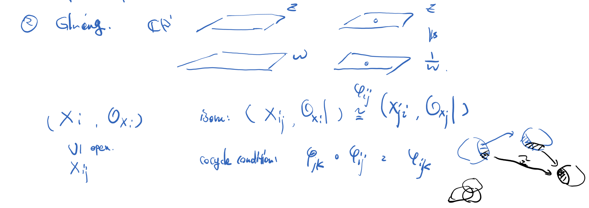

 交换代数笔记0: 简介

 作者: Su 

---

交换代数一般来讲被理解为研究交换环的理论。而交换环会出现在数论和代数几何中，所以交换代数也被视作代数数论和代数几何的先导科目。

作为一个初步的交换代数的讨论班，我们将我们的目的限定为理解 Atiyah [Introduction to commutative algebra] 书中常用的内容和习题。所以我们本次讨论班的主线会围绕 Atiyah 的交换代数展开。

Atiyah 的交换代数的主题(根据本讨论班组织者个人的兴趣)被理解为**代数簇局部的几何性质**，当然另一个说法就是**交换代数**。所以我们的讨论班的内容可以被理解成介绍我们的几何对象(概形，仿射概形)以及它们的相应几何性质。并在介绍中完成 Atiyah 书后相关的习题。

首先我们需要理解什么是我们的**几何对象**或者**几何体**。在整个讨论班中，我们都将**几何体**理解为环化空间，也就是一个对 $(X,\mathscr O_X)$ 其中 $X$ 为一个拓扑空间，$\mathscr{O}_X$ 为 $X$ 上的环层。比如说在研究微分拓扑时，我们大多数时候感兴趣的几何体被称作**光滑流形**，它可以解释成一个局部同构于 $(\R^n,C^\infty_{\R^n})$ 的第二可数 Hausdorff 的局部环化空间，这里，$C^\infty_{\R^n}$ 表示 $\R^n$ 上的光滑函数层。我们在考虑复几何时，感兴趣的几何体被称作**复流形**，它是一种局部上同构于 $(D^n,\mathscr{O}_{D^n})$ 的环化空间。其中 $D^n$ 表示 $\C^n$ 中的开圆盘，$\mathscr O_{D^n}$ 表示开圆盘上的全纯函数层。

> **<u>Remark</u>.** 这里有一个小的观察，如果我们固定拓扑空间上的不同的函数环层，所得到的几何体会有不同的刚性。比如如果我们考虑连续函数或者光滑函数，所得的拓扑流形或微分流形，就是非常柔软的几何体。而当我们考虑的是全纯函数时，我们的几何体就会具有很强的刚性。再进一步，如果我们考虑的是"多项式函数"，那么我们会得到更强的刚性，而这就是代数簇。

层论起源于二战时期 Leray 的研究。1945年二战结束后，Leray 将成果整理并在法兰西科学院发表。在此期间，H. Cartan (陈省身先生的老板的儿子) 将层论引入对复流形与解系函数的研究中，得到很多非常重要的定理。同一时期，Serre 也在 Cartan 讨论班上。Serre 发现我们不仅可以用层论来考虑复流形，也可以用它考虑"多项式对应几何体"也就是代数簇。于是就有了著名的文章 [Serre, Jean-Pierre (1955), "Faisceaux algébriques cohérents", *Annals of Mathematics*, **61**: 197–278]。

我们再仔细看看我们的几个几何对象:
$$
(\R^n,C^\infty_{\R^n}),\ \ (D^n,\mathscr{O}_{D^n}),\ \ \text{``} (\C^n,\text{polynomials})\text{"}.
$$
首先我们来看看光滑函数。首先我们有一串光滑函数环 $\{C^\infty(U)\}_{U\subset \R^n}$ 其中 $C^\infty(U)$ 表示开集 $U$ 上定义的光滑函数。并且不同开集，如果有包含关系 $U\subset W$，则有限制同态 $r^W_U:C^\infty(W)\to C^\infty(U)$，满足 $r^U_U=\text{id}$ 并且对于 $V\subset U\subset W$，有$\ r^U_V\circ r^W_U=r^W_V$。另一方面，这些某个开集上定义的光滑函数满足限制和粘合公理。其中限制公理是指一个大开集上的光滑函数，如果限制在某个开覆盖的每个小开集上都等于零，那么这个函数等于零。粘合公理是指，一些小开集并成一个大开集，那么小开集上的光滑函数，在交集上的限制两两相等，那么一定可以唯一的粘合成并集上的光滑函数。

根据这个例子，我们给出拓扑空间上的层的概念

**<u>Definition</u>.** (sheaf) 设 $X$ 为拓扑空间，拓扑空间上的 <u>Abel群/环</u> **预层**(presheaf) $\mathcal F$ 由如下数据给出
$$
(\{\mathcal F(U)\}_{U\subset X},\{r^U_V\}_{\forall\ V\subset U})
$$
其中 $\mathcal F(U)$ 为 <u>Abel群/环</u>，称为开集 $U$ 上层 $\mathcal F$ 的**截面** <u>群/环</u>，<u>群/环</u> 同态 $r^U_V:\mathcal F(U)\to \mathcal F(V)$ 被称为**限制映射**，我们也记为 $(\_)|_{V}$。限制映射要求满足 $r^U_U=\text{id}$ 并且对于 $V\subset U\subset W$，有$\ r^U_V\circ r^W_U=r^W_V$。如果预层 $\mathcal F$ 满足以下两条公理

+ **限制公理**: 对任意 $U$ 和开覆盖 $U=\cup_iU_i$，若 $f\in \mathcal F(U)$ 满足任意 $i$，有 $r^U_{U_i}(f)=0$，则 $f=0$。
+ **粘合公理**:  对任意 $U$，开覆盖 $U=\cup_iU_i$，以及 $f_i\in\mathcal F(U_i)$，满足 $f_i|_{U_{ij}}=f_j|_{U_{ij}}$ 则存在的 $f\in \mathcal F(U)$ 使得 $f_i=f|_{U_i}$。

则 <u>Abel群/环</u> 预层 $\mathcal F$ 被称为  <u>Abel群/环</u> **层**(sheaf)。

> **<u>Remark</u>.** 
>
> + ① 截面群和限制映射都是预层数据的一部分。
>
> + ② 如果 $X$ 为拓扑空间，那么 (全体开子集，含入映射) 构成一个范畴，我们记为 $\text{Op}_X$。分别记阿贝尔群范畴和环范畴为 $\Z\text{-mod}$ 和 $\textbf{Rings}$，则 $X$ 上的一个 Abel群/环 预层等价于一个从 $\text{Op}_X$ 到  $\Z\text{-mod}$/$\textbf{Rings}$ 的反变函子。
>
> + ③ 限制公理和粘合公理可以等价的陈述成， 对任意 $U$，开覆盖 $U=\cup_iU_i$，有 Abel 群正合列
>
> + $$
>   0\to \mathcal F(U)\xrightarrow{\prod r^U_{U_i}}\prod_{i} \mathcal F(U_i)\xrightarrow{(f_i)\mapsto (f_i|_{U_{ij}}-f_j|_{U_{ij}}) } \prod_{ij} \mathcal F(U_i\cap U_j).
>   $$
>
> + ④ 同一个拓扑空间的预层之间可以定义**预层态射**为反变函子的自然变换。从而拓扑空间 $X$ 上的预层构成**预层范畴** $\text{Psh}_X$。
>
> + ⑤ 我们定义同一个拓扑空间的层之间的态射为对应的预层态射，从而拓扑空间 $X$ 的全体(阿贝尔群)层，构成(阿贝尔群)**层范畴** $\text{AbShv}_X$，并且是预层范畴 $\text{Psh}_X$ 的满子范畴。

**<u>Remark</u>.** 对于层来讲，我们可以(在以后的talk里)定义层的推前与拉回。设 $f:X\to Y$ 为两个拓扑空间之间的连续映射，那么 $X$ 上的层 $\mathcal F$ 可以被推前到 $Y$ 上，记为 $f_*\mathcal F$，而 $Y$ 上的层 $\mathcal G$ 可以拉回得到 $X$ 上的层，记为 $f^{-1}\mathcal G$。并且推前与拉回构成一对伴随函子
$$
\text{Mor}_{\text{AbShv}_X}(f^{-1}\mathcal G,\mathcal F)\cong\text{Mor}_{\text{AbShv}_Y}(\mathcal G,f_*\mathcal F).
$$
 有了环层的概念，我们就有对应的环化空间的概念。

**<u>Definition</u>.** **环化空间**是指一个对 $(X,\mathcal O_X)$，其中 $X$ 为拓扑空间，$\mathcal O_X$ 为 $X$ 上的一个环层。两个**环化空间的态射**由底拓扑空间的连续映射和对应"函数环"的拉回给出。确切的说，环化空间 $(X,\mathcal O_X)$ 到  $(Y,\mathcal O_Y)$ 的态射被定义为 $(f,f^\flat)$，其中 $f:X\to Y$ 为连续映射，$f^\flat:\mathcal O_Y\to f_*\mathcal{O}_X$ 为环层同态。

> **<u>Remark</u>.** 根据上面的伴随，当底空间的连续映射 $f:X\to Y$ 确定后，环层态射 $f^\flat:\mathcal O_Y\to f_*\mathcal{O}_X$ 可以被伴随的态射 $f^{\sharp}:f^{-1}\mathcal O_Y\to \mathcal O_X$ 给出，所以我们也称 $(f,f^\sharp)$ 为环化空间 $(X,\mathcal O_X)$ 到  $(Y,\mathcal O_Y)$ 的态射。从而我们得到环化空间范畴。

> **<u>Remark</u>.** 根据构造，环化空间 $(X,\mathcal O_X)$ 在 $X$ 的开集 $U$ 上可以给出一个"开子环化空间" $(U,\mathcal{O}_X|_{U})$。
>
> **<u>Remark</u>.** 另一方面，根据态射的定义，我们就有环化空间**同构**的定义。

==有了开子集和同构，我们就可以谈**粘合**!==

 

**<u>Proposition</u>.** (Atiyah Ch1 习题26) 设 $A$ 为一个环，我们记 $A$ 的全体素理想集为 $\text{Spec}(A)$，并称为**素谱**。 $A$ 的全体极大理想的集合记为 $\text{Specm}(A)$，并称为**极大理想谱**。对一般的环而言，极大理想谱并不能满足环同态 $\phi:A\to B$ 给出集合映射 $\text{Specm}(B)\to\text{Specm}(A),\ \mathfrak p_B\mapsto\phi^{-1}(\mathfrak p_B)$，因为极大理想的原象不一定是极大理想。但是对于有限生成 $k$-代数而言这一说法是对的。在整性的部分我们会谈到这一点。

接下来的性质是盖尔方德在分析里最早给出的。设 $X$ 为一个紧 Hausdorff 拓扑空间，并记 $C(X)$ 为 $X$ 上的全体实值连续函数构成的环。其中加法为函数的加法，乘法为函数的乘法。对 $x\in X$，我们记 $\mathcal I(x)$ 为在 $x$ 点等于零的全体连续实值函数集。对于另一个函数 $h$ 乘以 $f\in \mathcal I(x)$ ，我们得到 $hf$ 在 $x$ 处也是零，从而可以看出 $\mathcal I(x)$ 为 $C(X)$ 里的一个理想。这个理想实际上是一个极大理想，因为我们有赋值同态
$$
 C(X)\xrightarrow{ev_x}\R ,\ f\mapsto f(x)
$$
这个同态的 kernel 正好是 $\mathcal I(x)$，因为赋值同态是满射并且值域是个域，所以 $\mathcal I(x)$ 是 $C(X)$ 的一个极大理想。 

对于 $C(X)$ 里的一些函数 $\{f_\alpha\}_{\alpha\in S}$，我们可以定义这些函数的公共零点 
$$
Z(\ f_\alpha\ |\ \alpha\in S)=\{\ x\in X\ |\  \forall\ \alpha\in S,\ f_\alpha(x)=0 \}\subset X
$$
注意到一个函数的零点是闭集，所以这些公共零点是闭集的交，所以它还是闭集。

直接利用定义可以看出，$\{f_\alpha\}_{\alpha\in S}$ 的公共零点集等于这个集合生成的理想的公共零点集。

在 $C(X)$ 的极大谱 $\text{Specm}(C(X))$ 上面，我们还可以定义 Zariski 拓扑，即开集为某个连续函数非零点的集合 $\tilde D_f=\{\mathfrak m\in\text{Specm}(C(X))\ |\ f\notin \mathfrak m\}$。

以上构造可以给出如下的映射:
$$
X\to \text{Specm}(C(X)),\ x\mapsto \mathcal I(x).
$$
我们可以证明这个映射实际上是一个同胚。

==换言之，在紧 Hausdorff 拓扑空间的情况下，底空间的拓扑结构可以完全被它上面的连续函数环的环结构确定==

+ - 首先这个映射是个满射。也就是说任取一个极大理想 $\mathfrak m\subset C(X)$ 它一定是某个点的零点理想。这个点实际上就是 $\mathfrak m$ 的公共零点 $Z(\mathfrak m)$。$Z(\mathfrak m)$ 不能为空，如果它是空集就说明这个极大理想里的函数们没有公共零点，这样的话我们在 $X$ 的每个点 $x$ 都可以找到一个极大理想中的连续函数 $f_x$，使得它在点 $x$ 处不等于零。根据连续性，$f_x$ 在 $x$ 附近的一个开集里不等于零。记 $f_x$ 不等于零的点为 $D_{f_x}=X-Z(f_x)$，则 $\{D_{f_x}\}_{x\in X}$ 构成了 $X$ 的开覆盖。从而由于 $X$ 是紧集，所以有有限子覆盖 $D_{f_1},\ldots,D_{f_n}$。这时，我们会发现，函数 $f_1^2+\cdots+f_n^2$ 在 $X$ 上点点不为零(从而可逆)，并且每个 $f_i$ 都在极大理想 $\mathfrak m$ 里，就说明 $1\in \mathfrak m$ 于是推出矛盾。也就是 $\mathfrak m$ 的公共零点不为空。取 $y\in Z(\mathfrak m)$，注意到 $\mathfrak m\subset \mathcal I(y)$，又因为 $\mathfrak m$ 是极大理想，所以 $\mathfrak m=\mathcal I(y)$。也就是说，上面的映射是个满射。
  - 这个映射是个单射，这是因为紧 Hausdorff 空间上面两个不同的点一定可以存在一个函数在一个点等于零，在另一个点等于 $1$。(这是因为乌雷松引理)。这就说明了不同点的零点理想不同。所以这是个单射。
  - 这是个同胚，因为开集 $D_f$ 被映成 $\tilde D_f$。而任何一个紧 Hausdorff 空间的闭集都是有限个连续函数的公共零点，所以开集一定是有限个 $D_f$ 的并，所以这是个同胚。

总之，这个题说明环化空间 $(X,C_X)$ 可以完全由 $X$ 上的连续函数环 $C(X)$ 决定。

在接下来的讨论班中，对于环 $A$，我们可以类似的构造出一个完全由 $A$ 决定的局部环化空间，其底集合为 $\text{Spec}(A)$，拓扑为 Zariski 拓扑，而环层由 $D_f\mapsto A[\frac{1}{f}]$ 给出。我们记所得到的局部环化空间为 $(\text{Spec}(A),\mathcal O_{\text{Spec}(A) })$，并称之为**仿射概形**(affine scheme)，我们将仿射概形在环化空间范畴里粘合得到的环化空间 $(X,\mathcal O_X)$ 称为**概形**(scheme)。这也是我们代数几何和交换代数中主要研究的几何对象。所以我们在接下来的讨论班中就要考虑这种几何体的几何性质以及对应的环的性质。

+ - 环的性质和对应仿射概形的拓扑性质
  - 开子概形/闭子概形和对应的环
  - 概形的态射与环同态
  - 概形的乘积与环的张量积
  - 概形上的 (quasi-)coherent sheaf 与环上的模
  - 概形的维数与环的维数
  - 开映射与光滑映射
  - 闭嵌入与有限映射

等等这些性质。

在接下来的讨论班中，我们会介绍如下内容

1. 模的张量积，Hom，$\otimes$，投射/平坦模，分式环与局部化，小根与大根(su)
2. Noetherian 环与 Artin 环(su)
3. 模范畴，正合函子，投射模，内射模，链复形，同调群 (唐龙天，王益铭)
4. 同调函子，导出函子(杨亦诚，杨亦阳，王梓畅)
5. Ext 和 Tor 的基本性质及应用(范一飞，李浩铖，郝宇衡)
6. 完备化，复流形和它上面的层(董子楷，任建宇，廖健淞，蒋耀)
7. 环的素谱、仿射概形(李宇轩，梁石易新，蔡振楠)
8. 仿射概形上的 quasi-coherent 层(黄汇智，吕昕瑶)
9. 概形的纤维积，粘合与局部性质 (谈夏羽，刘壹)
10. 概形与环的维数(杨梦琪，蒋昊)
11. Zariski tangent spaces，flat morphism，(陶立宇，蔡振楠)
12. Kaehler differentials，smoothness(侯宇轩，李昊沂)
13. 赋值与数论(傅俊宁，钟灿，郝宇衡，范一飞; 指导: 唐龙天)
14. finite morphism，整相关(曾瑞安，郝宇衡)
15. 一维概形与一维环(李钒祎，蔡子悦，蒋耀)

**讨论班的讲课要求:**

我们希望讨论班的时候需要讲清所讲内容的逻辑脉络，尽量用一个故事穿起来(可以适当牺牲严格性和一般性)。讲的时候尽量讲清楚每个定义，构造，定理背后的直观。但是并不过度强调技术细节。比如我们可以陈述比较一般的版本，而证明一个相对特殊(加了一些合理假设后)的版本，以力求对定理及其证明有所理解，然后有余力的同学可以试试谈谈定理的一般版本和特殊版本差距在哪儿。

**讨论班的讲义要求:**

讲义要求写成md格式。与讨论班的课的要求类似，也是要整理出比较容易理解的逻辑脉络，讲清楚每个定义，构造，定理背后的直观。要求尽量口语化，非论文化，力求直观。写完后可以与图片一起压缩在一个压缩文件中上传。