
 交换代数笔记1: 环与模

 作者: Su、彩笔 

## 目录

[toc]

---

本节中我们主要给出环与模相关概念的回顾并在最后介绍局部化的概念和简单性质。

### 环、模与理想

在本小节中，我们列出环、模与理想的基本定义。

#### 环

**<u>Definition</u>.** 一个**环**是指一个集合配上**加法**、**乘法**运算，使得加法构成加群，乘法封闭且有对加法的分配律。

**<u>Example</u>.** 几个重要的一般环的例子

1. $\mathbb Z$ 整数环；
2. $k$ 域；
3. $k$ 或 $\Z$ 上的多项式环 $k[x_1,\ldots,x_n]$。

**<u>声明</u>.** 讨论班中，如不另做说明，则**环**特指**有单位元的交换环**。

**<u>Definition</u>. ** 设 $R,S$ 为两个环，一个保持加法，乘法和乘法单位元1的映射 $\phi:R\to S$ 称为**环同态**。

**<u>Definition</u>. ** 固定系数底环的环称为**代数**。更确切的说，设 $A$ 为一个环，则 **$A$-代数范畴**是指在 $A$ 下的环组成的下范畴(undercategory)，其对象为从 $A$ 出发的环同态，而任取两个这样的环同态 $A\to B_1$ 和 $A\to B_2$ ，它们之间的态射被定义为保持 $A$ 的环同态，换言之，就是一个环同态 $\phi:B_1\to B_2$，满足条件 $\phi(a\cdot b)=a\cdot \phi(b)$。

####  环上的模

设 $M$ 为一个加法群，则 $\text{Mor}_{\textbf {Grp}}(M,M)$ 为全体 $M$ 的自同态集，则由于 $M$ 的加性，我们会发现，这些自同态可以良定义加法，而且有复合给出的乘法，加法和乘法还有分配律。这时我们发现 $\text{Mor}_{\mathbf {Grp}}(M,M)$ 自然有一个环结构，我们记作 $\text{End}(M)$ 。

**<u>Definition</u>.** 设 $A$ 为一个环， $M$ 是一个阿贝尔群，则 $M$ 上的 **$A$-模结构**是指 $M$ 可以有类似 “$A$-线性空间的结构”，也就是 $A$ 可以数乘在 $M$ 的元素上，并且与 $M$ 和 $R$ 的加法适配。换言之，这样一个 $A$-模结构可以等价的由一个 $A$ 到 $\text{End}(M)$ 的环同态给出。进一步，我们可以定义 **$A$-模范畴**，对象为 $A$-模，态射为 $A$-线性的阿贝尔群同态。记为$A$-mod。

**<u>Definition</u>.** 设 $A$ 为一个环，$M$ 为一个 $A$-模。一个 $M$ 的 **$A$-子模**是指一个$A$-左乘封闭的 $M$ 的子加群。记 $N\subset M$ 为 $A$-子模，则商群 $M/N$ 上可以自然赋予一个由 $M$ 的模结构诱导的 $A$-模结构，称为 $M$ 的**商模**。

**<u>Proposition</u>.** 设 $A$ 为一个环， $M,N$ 为两个 $A$-模，$f:M\to N$ 为一个 $A$-模同态，则 $f(M)$ 为 $N$ 的子 $A$-模，而 $f^{-1}(0_N)$ 是 $M$ 的子 $A$-模。

**<u>Definition</u>.** 设 $A$ 为一个环， $M,N$ 为两个 $A$-模，$f:M\to N$ 为一个 $A$-模同态，称 $f^{-1}(0_N)$ 为同态 $f$ 的**核**，记为 $\text {Ker}(f)$，称 $f(M)$ 为同态 $f$ 的**像**，记为 $\text{Im}(f)$，称商模 $N/f(M)$ 为同态 $f$ 的**余核**，记为 $\text {Coker}(f) $。  

**<u>Proposition</u>.** 设 $A$ 为一个环， $M,N$ 为两个 $A$-模，$f:M\to N$ 为一个 $A$-模同态，则

+ $f$ 为单射若 $\text {Ker}(f)=0$，此时称 $f$ 为**单同态**；  
+ $f$ 为满射若 $\text {Coker}(f)=0$，此时称 $f$ 为**满同态**；
+ $f$ 为模同构当且仅当 $f$ 即单又满。

**<u>Example</u>.** 设 $A,B$ 为两个环，设 $f:A\to B$ 为一个环同态，则 $f$ 给出 $B$ 一个 $A$-模结构。换言之，$A$-代数都是 $A$-模，粗略的说，$A$-代数就是具有 $A$-线性 乘法的 $A$-模。当然，$A$-代数同态也是 $A$-模同态，换言之，我们有一个从 $A$-代数范畴到 $A$-模范畴的遗忘函子 $U:A\text{-Alg}\to A\text{-mod} $，忘却它上面的乘法。

**<u>Definition</u>.** 设 $A$ 为环，$M$ 为 $A$ 模， $S\subset M$ 为子集，则 $S$ 中有限个元素的 $A$-线性组合构成 $M$ 的子模，称为**由子集 $S$ 生成的子模**。记为 $(S)$。如果 $(S)=M$ 则称模 $M$ 被子集 $S$ **生成**，$S$ 中的元素称为**生成元**，$S$ 被称为生成元集。如果模 $M$ 存在一个有限生成集 $S$，则称 $M$ 为**有限生成模**。

**<u>Definition</u>.** 设 $I$ 为指标集，$M_i,i\in I$ 为由 $I$ 参数化的一族 $A$-模。则我们有集合(阿贝尔群) $\prod_{i\in I}M_i$，赋予分量的 $A$-左乘，可以得到一个 $A$-模结构，我们称这个 $A$-模为 这一大堆 $A$-模 $M_i,i\in I$ 的**乘积**或**直积**。它的元素为一列 $(\ldots, m_i,\ldots)_{i\in I, m_i\in M_i}$ 。直积  $\prod_{i\in I}M_i$ 中有一个子集
$$
\bigoplus{i\in I}M_i:={(\ldots, m_i,\ldots)|\ 只有有限个m_i不为零}\subset\prod{i\in I}M_i
$$
可以验证它关于加法和 $A$ 的数乘封闭，所以它是个子模，我们称这个子模为这一大堆 $A$-模 $M_i,i\in I$ 的**直和**。

**<u>Definition</u>.** 设 $A$ 为环，若干个 $A$ 的直和得到的 $A$ 模称作**自由$A$-模**，形如 $A^{\oplus I}$。其中 $I$ 的基数被称作这个自由模的**秩**(rank)。

> **<u>Remark</u>.** 可以验证如上定义的模的直和与直积满足模范畴的直和与直积的泛性质，所以模范畴存在直和与直积。

**<u>Proposition</u>.** 设 $A$ 为环，$M$ 为 $A$ 模。则 $M$ 为有限生成 $A$ 模当且仅当 存在有限 rank 的自由模到 $M$ 的满射。

#### 理想

设 $A,B$ 为两个环，设 $f:A\to B$ 为一个环同态，我们考虑 $f^{-1}(0_B)$。我们发现这个集合加法封闭并且乘法吸收，并且换言之是个 $A$ 的子 $A$-模。

**<u>Definition</u>.** $A$ 的子 $A$-模称作 $A$ 的**理想**。

**<u>Example</u>.** 设 $A$ 为环， $S\subset A$ 为子集，则 $S$ 中有限个元素的 $A$-线性组合构成 $A$ 的子模，称为**由子集 $S$ 生成的理想**。记为 $(S)$。如 $k[x,y]$ 中的理想 $(x,y)$。

**<u>Definition</u>.** 由一个元素生成的理想称为**主理想**，由有限个元素生成的理想称为**有限生成理想**。

有了理想以后我们就可以构造商环了，设 $A$ 为环，$I\leq A$ 为 $A$ 的理想，则在商 $A$-模 $A/I$ 上，$A$ 的乘法可以诱导一个 $A/I$ 上的乘法，我们称这个在商集上的环结构为**商环**。于是我们有:

**<u>Proposition</u>.** 

+ 环同态的核是理想，商掉理想的商环同构于同态像。
+ 理想一定是环同态的核，$I\leq A$ 是 $A\to A/I$ 的核。

商掉一个理想的操作可以理解为令理想里的元素都变成零，并且还保持加法，乘法，这样的话，原来的环就恰好塌缩成商环。

**<u>Example</u>.** 

+ $\Z[\sqrt{-5}]=\Z[x]/{(x^2+5)}$;
+ $\Z[\sqrt{-5}]/\!_{(p)}=\frac{\Z[x]/\!_{(x^2+5)}}{(p)}\cong \frac{\Z[\sqrt{-5}]}{(p,x^2+5)}\cong \frac{\Z[x]/(p)}{(x^2+5)}=\mathbb F_p[x]/\!_{(x^2+5)}$ 

 **<u>Definition</u>.** 设 $A$ 为一个环，一个同构于 $A$ 上多元多项式代数的商代数的 $A$-代数被称为 **有限生成 $A$-代数**。换言之，$B$ 为有限生成 $A$代数，若存在从多项式 $A$ 代数到 $B$ 的 $A$-代数满同态 $f:A[x_1,\ldots,x_N]\to\!\!\!\!\!\to B$。 有限生成 $A$-代数范畴为有限生成 $A$-代数在全体 $A$-代数范畴里确定的满子范畴。

### 模的张量积

#### 交换环上模的张量积的定义

设 $A$ 为有单位元的交换环。作为极限与余极限的一些应用，我们下面讲讲 $A$ 模范畴中张量积的性质。这里的张量指的是模或者环的张量，而他们于微分几何中所谓“张量场”只有弱而微妙的联系。所以初次接触的时候建议视二者为无关的两个概念。

模的张量积是由两个模构造第三个模的一种构造方法。如果环 $A$ 是个域，记为 $k$，则 $A$ 模都是 $k$-向量空间，两个向量空间 $V,W$ 在 $k$ 上的张量 $V\otimes_k W$ 为以 $\sum_\text{finit} v\otimes w$ 为元素的 $k$-向量空间，满足类似 $(av_1+bv_2)\otimes w=a\ v_1\otimes w+b\ v_2\otimes w$ 的关系。并且若 $(v_1,...,v_m)$ 为 $V$ 的一组基，$(w_1,...,w_n)$ 为 $W$ 的一组基，则 $V\otimes_k W$ 为以 $(...,v_i\otimes w_j,...)$ 为基底的 $mn$ 维向量空间。

**<u>Definition</u>.** 设 $A$ 为环，$M,N$ 为 $A$-模，则 $M\otimes_A N$ 由形如 $\sum_\text{finite}{m_i\otimes n_i}, \ m_i\in M,n_i\in N$ 的元素组成，并且表达式满足关系，对任意 $m_1,m_2,m\in M,\ n_1,n_2,n\in N,\ a,b\in A$ 

+  $(am_1+bm_2)\otimes n=a\ m_1\otimes n+b\ m_2\otimes n$，$m\otimes (an_1+bn_2)=a\ m\otimes n_1+b\ n\otimes m_2$，
+  $a(m\otimes n)=(am)\otimes n=m\otimes(an)$。

**<u>Remark</u>.** 其中构造可以按上面描述的，由 $\{m\otimes n\}_{m\in M,n\in N}$ 生成自由模，然后商掉上面的关系生成的子模。

**<u>Example</u>.** $\Z/\!_{(p)}\otimes \Z/\!_{(q)}=0$ 。注意里面的元素都是 $m\otimes n$ 这样元素的线性组合，且 $m\otimes n=mn(1_p\otimes 1_q)$ 。利用 $p1_p=0$，$q1_q=0$ ，$ap+bq=1\in\Z$ 从而推出 $bq1_p=1_p, ap1_q=1_q$ 从而 $1_p\otimes 1_q=(bq)1_p\otimes 1_q=(b1_p)\otimes (q1_q)=0$ 。所以 $\Z/\!_{(p)}\otimes \Z/\!_{(q)}=0$ ，因为它里面的元素都是零。

**<u>Remark</u>.** 这个例子想说明，一般环上模的张量积要比线性空间的张量积复杂。

**<u>Example</u>.** 

+ 若 $k$ 为域，则 $k^{\oplus m}\otimes_k k^{\oplus n}\cong k^{\oplus mn}$ 。
+ 在不同系数环上张量积不一样，$\mathbb C\otimes_\mathbb C\mathbb C\cong \mathbb C$，但 $\mathbb C\otimes_\R\mathbb C\cong \mathbb R^{\oplus 4}$ 。

**<u>Proposition</u>.** 可以用定义直接验证: (存在双射且 $A$-线性)

+ $M\otimes_A A\cong M,\ m\mapsto m\otimes 1,\ m\otimes a\mapsto a\cdot m$，
+ $M\otimes N\cong N\otimes M, m\otimes n\mapsto n\otimes m$。

**张量积的泛性质**: 首先我们定义双线性映射

**<u>Definition</u>.** 设 $A$ 为环，$M,N,T$ 为 $A$ 模。映射 (不是 $A$ 模同态，也不是阿贝尔群同态) $f:M\times N\to T$ 称为 **$A$-双线性映射**，若 $f$ 满足对任意 $a\in A,\ m\in M,\ n\in N$ 有

+ $f(am_1+bm_2,n)=a\ f(m_1,n)+b\ f(m_2,n)$ $f(m,an_1+bn_2)=a\ f(m,n_1)+b\ f(m,n_2)$ ，
+ $f(am,n)=af(m,n)=f(m,an)$。

> **<u>Remark</u>.**
>
> + 双线性映射并不是 $M\oplus N$ 到 $T$ 的 $A$-模同态，因为在 $M\oplus N$ 里，$a(m,n)=(am,an)$ (注意，$M\times_\textbf{Sets} N$ 上并不预定 $A$ 模结构) 此时，根据双线性性，$f(a\cdot (m,n))=f(am,an)=a^2f(m,n)$，不 $A$-线性。
> + 但是全体 $M\times N$ 到 $T$ 的双线性映射集 $\textsf{BL}_A(M\times N,T)$ 却具有 $A$ 模结构。即 $f,g$ 为双线性映射，任取 $a,b\in A$ 则 $af+bg$ 也是双线性映射。
> + 双线性映射取定一个分量的值以后就是(单)线性映射，换言之，双线性映射 $f:M\times N\to T$ 可以对应成映射 $f':M\to \text{Mor}_{A\text{-mod}}(N,T),\ m\mapsto f(m,\_)$ 的线性映射。

从而我们实际上得到了 $A$ 模同构

> $\begin{aligned}\textsf{BL}_{A-mod}(M\times N,T)\cong_A \text{Mor}_{A\text{-mod}}(M,\text{Mor}_{A\text{-mod}}(N,T))\\ \cong_A \text{Mor}_{A\text{-mod}}(N,\text{Mor}_{A\text{-mod}}(M,T))\end{aligned}$ 

有了上面定义的铺垫，我们可以陈述**张量积的泛性质**。设 $M,N$ 为 $A$ 模，则有集合间的映射

 $\tau:M\times N\to M\otimes_A N,\ (m,n)\mapsto m\otimes n$ 

可以直接验证，对任意 $A$ 模 $T$ ，上面的映射可以诱导 $A$ 模同构

$$
\text{Mor}_{A\text{-mod}}(M\otimes_AN,T)\stackrel{\tau^*}{\cong_A}\textsf{BL}_{A\text{-mod}}(M\times N,T),\\
\phi\mapsto \phi\circ\tau,\ f\mapsto (\ \sum m\otimes n\mapsto \sum f(m,n)\ )
$$
换言之，张量积的泛性质就是 $\textsf{BL}_A(M\times N,\_)$ 可表，并且表示对象是 $M\otimes_A N$ 。

#### $A$-mod 范畴中 Hom 与 tensor 的伴随

**<u>Corollary</u>.** 设 $N$ 为 $A$ 模，则对任意 $A$ 模 $M,T$，有自然同构 

 $\text{Mor}_{A\text{-mod}}(M\otimes_AN,T)\cong_A \text{Mor}_{A\text{-mod}}(M,\text{Mor}_{A\text{-mod}}(N,T))$ 

换言之，就是 $(\ (\_)\otimes_A N,\text{Mor}_{A\text{-mod}}(N,\_)\ )$ 为伴随函子。

**<u>Corollary</u>.** $M\otimes_A(\bigoplus_{i\in I}N_i)\cong \bigoplus_{i\in I} (M\otimes_A N_i)$ .

> 左伴随与colimit交换

设 $A$ 为一个交换环，记 $A$-模范畴为 $A\text{-mod}$。以 $\Z$ 为指标参数化的一列 $A$ 模 $\{M^i\}_{i\in \Z}$ 和一列次数加1的模同态 $\{d^i:M^i\to M^{i+1}\}_{i\in\Z}$ 如果对任意 $i$ 满足 $d^{i+1}\circ d^i=0$ (等价的，$Im(d^i)\subset \text {Ker}(d^{i+1})$)，则称这一族模与态射 $(M^{\scriptscriptstyle\bullet} ,d^{\scriptscriptstyle\bullet} )$ 为$A$模**上链复形** (因为指标数增加所以叫上链，如果指标下降，我们一般用下标，并称为 **下链复形**)。我们往往将链复形以模范畴中的图表示为

   $$\cdots \xrightarrow{d^{i-1}} M^i\xrightarrow{d^i} M^{i+1}\xrightarrow{d^{i+1}} M^{i+2}\xrightarrow{d^{i+2}} M^{i+3}\xrightarrow{d^{i+3}} M^{i+4}\to \cdots$$   

并且将不同分次的 $d^i$ 统一表示成 $d$，并省略 $d$ 将这个上链复形简记为 $M^{\scriptscriptstyle\bullet}$。这些 $\{d^i\}$ 被称作上链复形 $M^{\scriptscriptstyle\bullet}$ 的微分 (differential)。

一个上链复形 $M^{\scriptscriptstyle\bullet}$ 如果 $i<a$ 和 $i>b$ 的位置的模都是零，则称其为**集中**在 $[a,b]$ 区间的上链复形。

一个上链复形如果在 $M^i$ 处有 $\text{Ker}(d^{i})=\text{Im}(d^{i-1})$ (往后走的kernel等于前面的differential的image)，则称其在 $i$ 处**正合**。在每一处都正合的上链复形称作**长正合列**，集中在 $[0,2]$ 的长正合列被称为**短正合列**。

+ 设 $M^{\scriptscriptstyle\bullet}=\ 0\to M^0 \xrightarrow{d^0}  M^1 \xrightarrow{d^1}M^2\to 0$ 为集中在 $[0,2]$ 的上链复形，则以下等价
  - $M^{\scriptscriptstyle\bullet}$ 为短正合列；
  - $M^0$ 通过 $d^0$ 同构于 $\text{Ker}(d^1)$ 且 $d^1$ 为满射；
  - $d^0$ 为单射且 $\text{Coker}(d^0)=M^1/\!_{d^0(M^0)}$ 通过 $d^1$ 同构于 $M^2$。

**<u>Definition</u>.** 设 $M^{\scriptscriptstyle\bullet}=\ 0\to M^0 \xrightarrow{d^0}  M^1 \xrightarrow{d^1}M^2\to 0$ 为集中在 $[0,2]$ 的上链复形，若$M^0$ 通过 $d^0$ 同构于 $\text{Ker}(d^1)$，则称这个链复形为**左正和列**，若$\text{Coker}(d^0)=M^1/\!_{d^0(M^0)}$ 通过 $d^1$ 同构于 $M^2$，则称这个链复形为右正合列。左正和列也记为 $0\to M^0 \xrightarrow{d^0}  M^1 \xrightarrow{d^1}M^2$，右正合列也记为 $M^0 \xrightarrow{d^0}  M^1 \xrightarrow{d^1}M^2\to 0$。

**<u>Corollary</u>.** 考虑 $(\_)\otimes_A N$ 和 $\text{Mor}_{A\text{-mod}}(N,\_)$ 这一对伴随函子， $(\_)\otimes_A N$ 保持 cokernel， $\text{Mor}_{A\text{-mod}}(N,\_)$ 保持kernel。换言之，对任意短正合列 $0\to X\to Y\to Z\to 0$，我们有右正合列
 $X\otimes_A N\to Y\otimes_A N\to Z\otimes_A N\to 0$ 
和左正和列
 $0\to \text{Mor}_{A\text{-mod}}(N,X)\to \text{Mor}_{A\text{-mod}}(N,Y) \to \text{Mor}_{A\text{-mod}}(N,Z)$.

> 实际上左正和列可以直接验证，它就是kernel的泛性质。类似的， $Z=\text{Coker}(X\to Y)$ 的泛性质，翻译成模的语言，即得到左正和列
>
> $0\to \text{Mor}_{A\text{-mod}}(Z,N)\to \text{Mor}_{A\text{-mod}}(Y,N) \to \text{Mor}_{A\text{-mod}}(X,N)$

#### 投射模 与 平坦模

在上一小节，我们接触到了两个重要的函子，就是 $A$ 模范畴间的 Hom 函子和 tensor 函子。并且保持一定的正合性，下面我们来进一步分析这些性质。

##### 加法范畴与加性函子

如果我们要考虑正合性之类的性质，我们范畴需要具有 kernel 和 cokernel 的构造。比如 $A$ 模范畴就满足这样的性质。根据经验，我们将 $A$ 模范畴的性质抽象出来得到以下的定义。

**<u>Definition</u>.** (additive category) 一个范畴 $C$ 被称为**加法范畴**(additive category)，若满足如下三条性质:

1. (加性) 态射集都是加法群，也就是 $\Z$ 模。并且态射的复合是加法群同态。
2. (零元) 存在始对象，终对象，并且二者同构。我们称这样的始/终对象为**零对象**。
3. (直和直积) 存在有限直和、有限直积，并且有限直和与直积同构。

> **<u>Remark</u>.** 
>
> + ① 如果只满足前两个性质，$C$ 实际上是 $\Z$-mod enriched category，这种范畴我们称为**预加法范畴**(pre-additive category)。
>
> + ② 考虑加法范畴 $C$ 的态射集 $\text{Hom}_C(M,N)$，一个态射 $f\in\text{Hom}_C(M,N)$ 是零映射当且仅当它穿过零对象分解。如果我们记 $C$ 的零对象为 $0_C$，我们会发现，$\text{Hom}_C(M,0_C)$ 和 $\text{Hom}_C(0_C,N)$ 都是只有一个元素(因为 $0_C$ 是始/终对象)的阿贝尔群(因为阿贝尔范畴)，从而为零阿贝尔群，所以复合以后落在 $\text{Hom}_C(M,N)$ 中的元素为 $\text{Hom}_C(M,N)$ 中的零元。
>
> + ③ $C$ 中的 $T$ 同构于 $M,N$ 的直和(直积) 可以翻译成态射的语言:
>
> + - $T$ 满足直和的泛性质，所以有 $M \xrightarrow{i_M} T$ 和 $N \xrightarrow{i_N} T$;
>   - $T$ 满足直积的泛性质，所以有 $T\xrightarrow{p_M}M$ 和 $T\xrightarrow{p_N}N$;
>   - 直和与直积同构，所以有 $p_M\circ i_M=\text{id}_M,\ p_N\circ i_N=\text{id}_N$ 以及 $i_M\circ p_M+i_N\circ p_N=\text{id}_T$。
>
>   换言之，如果 $C$ 中的对象 $T,M,N$ 之间有态射 $p_M,p_N,i_M,i_N$ 满足关系 $p_M\circ i_M=\text{id}_M,\ p_N\circ i_N=\text{id}_N$ 以及 $i_M\circ p_M+i_N\circ p_N=\text{id}_T$，则 $T$ 同构于 $M,N$ 的直和(直积)。

**<u>Definition</u>.** (additive functor) 设 $C,D$ 为两个加法范畴，$F:C\to D$ 为函子。我们称 $F$ 为**加性函子**(additive functor)如果 $F$ 在每个态射集上诱导的映射 
$$
F_{M,N}:\text{Hom}_C(M,N)\to\text{Hom}_D(FM,FN),\ \forall M,N\in \text{Ob}(C)
$$
为加法群同态。

> **<u>Remark</u>.** 
>
> + ① 加性函子实际上是对应 pre-additive 范畴间的 $\Z$-mod enriched 函子。
> + ② 注意函子保持复合和 $\text{id}$，加性函子保持加群结构，所以加性函子将直和映成直和。

对于加法范畴，我们可以利用泛性质来定义态射的 kernel 和 cokernel 。比如说 $M\xrightarrow{f}N$ 是加法范畴 $C$ 里的一个态射，那么 $\text{Ker}(f)$ (不一定存在) 被理解成$C$ 里一个态射 $\text{Ker}(f)\xrightarrow{i}M$， 满足如下泛性质: 

+ - 复合态射 $\text{Ker}(f)\xrightarrow{i_{kerf}}M\xrightarrow{f}N$ 是 $\text{Ker}(f)$ 到 $N$ 的零映射。

  -  任取态射 $K\xrightarrow{i_K}M$ ，使得复合 $f\circ i_K=0$ 那么存在唯一 $j_K:K\to\text{Ker}(f)$，使得 $i_K=i_{kerf}\circ j_K$。

    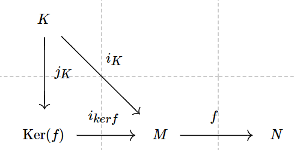

换言之，对任意的 $K\in \text{Ob}(C)$，
$$
0\to \text{Hom}_{C}(K,\text{Ker}(f))\xrightarrow{i_{kerf*}}  \text{Hom}_{C}(K,M) \xrightarrow{f_*}  \text{Hom}_{C}(K,N)
$$
为左正和列。

> 即 $\text{Hom}_{C}(\ \_\ ,\text{Ker}(f))$ 为函子范畴中自然变换 $\text{Hom}_{C}(\ \_\ ,M) \xrightarrow{f_*}  \text{Hom}_{C}(\ \_\ ,N)$ 的 kernel，也就是 $\text{Ker}(f_*)$ 的表示对象。

Cokernel 的情况类似，满足泛性质: 

+ - 复合态射 $M\xrightarrow{f}N \xrightarrow{p_{cokerf}}\text{Coker}(f)$ 是 $M$ 到 $\text{Coker}(f)$ 的零映射。

  -  任取态射 $N\xrightarrow{p_X}X$ ，使得复合 $p_X\circ f=0$ 那么存在唯一 $q_X:\text{Coker}(f)\to X$，使得 $p_X=q_X\circ p_{cokerf}$。

    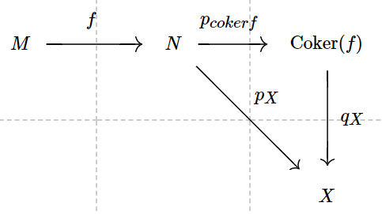

换言之，对任意的 $X\in \text{Ob}(C)$，
$$
0\to \text{Hom}_{C}(\text{Coker}(f),X)\xrightarrow{p_{cokerf}^*}  \text{Hom}_{C}(N,X) \xrightarrow{f^*}  \text{Hom}_{C}(M,X)
$$
为左正和列。

> 即 $\text{Hom}_{C}(\text{Coker}(f),\ \_\ )$ 为函子范畴中自然变换 $\text{Hom}_{C}(N,\ \_\ ) \xrightarrow{f^*}  \text{Hom}_{C}(M,\ \_\ )$ 的 kernel，也就是 $\text{Ker}(f^*)$ 的表示对象。

**<u>Definition</u>.** (abelian category) 设 $C$ 为一个 additive category，如果 $C$ 进一步满足:

1. 任何态射都存在 kernel 和 cokernel;
2. kernel 的 cokernel 总同构于 cokernel 的 kernel，即 $\text{Coker}(i_{kerf})\cong \text{Ker}(p_{cokerf})$ 对任意态射 $f$ 成立。

则我们称 $C$ 为**阿贝尔范畴**(abelian category)。

**<u>Example</u>.** 设 $A$ 为(不一定交换的有单位的结合)环，则 $A$ 模范畴为阿贝尔范畴。

> **<u>Remark</u>.** 阿贝尔范畴有着类似 $A$ 模范畴的性质。这个概念的提出最早是为了考虑拓扑空间上的阿贝尔群层范畴。这种范畴可以用泛性质定义 kernel 和 cokernel，但是 cokernel 的具体表达式并不直接，而泛性质却比构造往往更好用一些。

有一个大定理告诉我们阿贝尔范畴都可以正合的嵌入 $A$ 模范畴，所以大多数 $A$ 模范畴的同调代数都可以推广到更一般的阿贝尔范畴上。(特别的，拓扑空间上的阿贝尔群层范畴上)。

**<u>Proposition</u>.** (Freyd-Mitchell Embedding 定理) 若 $\mathcal{A}$ 为一个小(指全体态射构成集合)阿贝尔范畴，则存在一个(不一定交换但结合有单位的)环 $R$，以及一个正合的满且忠实的嵌入函子 $F:\mathcal A\to R\text{-mod}$。

**<u>Remark</u>.** 满且忠实保证了嵌入后的态射集同构于嵌入前的态射集，正合保证了 $\mathcal A$ 里的态射 $f$，视作 $R$ 模的态射 $F(f)$，取 $R$ 模的 kernel 或者 cokernel，所得到的正是 $f$ 在 $\mathcal A$ 中 kernel 和 cokernel 在嵌入 $F$ 下的像。

**<u>Remark</u>.** 这个定理的证明可以在 Mitchell 1965 年的书 [Theory of Categories] 里找到，当然很多范畴里的详细证明都可以在这本书里找到。

> 但阿库娅的教徒们实际上并不关心这个定理的证明，从来都是拿来就用，并且从不验证 small 的条件。

**<u>Definition</u>.** (左/右 正合函子) 设 $C,D$ 为阿贝尔范畴，$F:C\to D$ 为(正变)加性函子。

1. $F$ 称为**左正合函子**若 $F$ 保持 kernel，即 $F(\text{Ker}(f))\cong \text{Ker}(F(f))$。
2. $F$ 称为**右正合函子**若 $F$ 保持 cokernel，即 $F(\text{Coker}(f))\cong \text{Coker}(F(f))$。
3. $F$ 称为**正合函子**若 $F$ 将短正合列变为短正合列。

> **<u>Remark</u>.** 
>
> + ① 由于长正合列可以拆成短正合列，所以正合函子也保持长正合列。
> + ② 正合函子等价于左正和且把满射变成满射，也等价于右正合且把单射变成单射。
> + ③ 反变的 左正合/右正合/正合 函子 为 op 范畴出发的正变 左正合/右正合/正合函子。换言之，反变函子 $G:C^{op}\to D$ 左正合/右正合/正合，当且仅当 $G$ 把 $C$ 中的 cokernel 变成 $D$ 中的 kernel/ $C$ 中的 kernel 变成 $D$ 中的 cokernel/保持短正合列。
> + ④ 反变正合函子 $G:C^{op}\to D$ 等价于 
> + - 把 $C$ 中的 cokernel 变成 $D$ 中的 kernel 并且 把单射变成满射。
>   - 把 $C$ 中的 kernel 变成 $D$ 中的 cokernel 并且 把满射变成单射。

**<u>Example</u>.** 设 $A$ 为环，$M$ 为 $A$ 模。则

+ ① $\text{Hom}_A(M,\ \_\ ):A \text{-mod}\to A \text{-mod}$ 为正变左正合函子。
+ ② $\text{Hom}_A(\ \_\ ,M):A \text{-mod}\to A \text{-mod}$ 为反变左正合函子。
+ ③ $(\ \_\ )\otimes_A M\cong M\otimes_A(\ \_\ ):A \text{-mod}\to A \text{-mod}$ 为正变右正合函子。

##### 投射模与平坦模

**<u>Definition</u>.** 设 $A$ 为环，$P,I,M$ 为 $A$ 模。

+ - $P$ 称为**投射模**(projective module)若 $\text{Hom}_A(P,\ \_\ ):A \text{-mod}\to A \text{-mod}$ 为正变正合函子。
  - $I$ 称为**内射模**(injective module)若 $\text{Hom}_A(\ \_\ ,I):A \text{-mod}\to A \text{-mod}$ 为反变正合函子。
  - $M$ 称为**平坦模**(flat module)若 $(\ \_\ )\otimes_A M:A \text{-mod}\to A \text{-mod}$ 为正变正合函子。

> 根据这些函子本身的正合性，
>
> + - $P$ 称为**投射模**(projective module)若 $\text{Hom}_A(P,\ \_\ ):A \text{-mod}\to A \text{-mod}$ 把满射变为满射。
>   - $I$ 称为**内射模**(injective module)若 $\text{Hom}_A(\ \_\ ,I):A \text{-mod}\to A \text{-mod}$ 把单射变为满射。
>   - $M$ 称为**平坦模**(flat module)若 $(\ \_\ )\otimes_A M:A \text{-mod}\to A \text{-mod}$ 把单射变为单射。
>
> 前两者用交换图的语言翻译一下就是:
>
> + - $P$ 称为**投射模**(projective module)若满射都有提升。
>
>     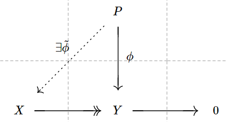
>
>   - $I$ 称为**内射模**(injective module)若单射都能扩张。
>
>     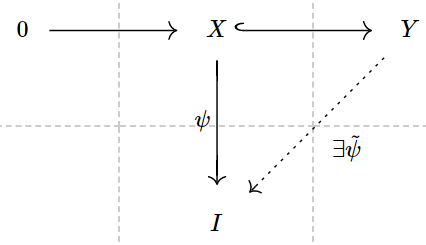

利用交换图的语言可以得到如下的性质:

**<u>Proposition</u>.** 设 $A$ 为环，$P$ 为投射 $A$ 模，$I$ 为内射 $A$ 模。则

1. 任意 $X$ 到 $P$ 的满射 $X\xrightarrow{\phi}\!\!\!\!\!\to P$ 一定 split，即存在 $s:P\to X$ 使得 $\phi\circ s=\text{id}_P$。此时 $P$ 为 $X$ 的直和因子。
2. 任意 $I$ 到 $Y$ 的单射 $j:I\to Y$ 一定 split，即存在 $p:Y\to I$ 使得 $p\circ j=\text{id}_I$。此时 $I$ 为 $Y$ 的直和因子。

注意到任何模都是自由模的商，所以有:

**<u>corollary</u>.** 投射模都是自由模的直和因子。

**<u>Example</u>.** 

1. 自由模都是投射模因为 $\text{Hom}_A(A^{\oplus J},\ \_\ )\cong (\_)^{\oplus J}$ 是正合函子。
2. 自由模都是平坦模因为 $(\ \_\ )\otimes_A A^{\oplus J}\cong (\_)^{\oplus J}$ 是正合函子。
3. 投射模都是平坦模因为如果 $P$ 投射，那么存在 $Q$，使得 $P\oplus Q$ 是自由模，由于 $(\_)\otimes_A(P\oplus Q)$ 保持单射，并且直和和张量积交换，所以 $(\_)\otimes_AP$ 保持单射，从而平坦。
4. 以后利用 tor 函子的性质可以证明，诺特环上的有限生成平坦模一定是投射模。
5. 以后利用 Baer 判别法可以证明 $\Q,\Q/\Z,\R,\R/\Z$ 都是内射 $\Z$-模。

#### 代数的张量与base change

设 $A$ 为环，对于 $A$ 模，我们有张量积的概念，即任给两个(或多个) $A$ 模 $M,N$ ($\{M_i\}_{i\in I}$) 我们可以定义它们的张量积 $A$ 模 $M\otimes_A N$ ($\bigotimes_{A\ i\in I}M_i$)。当其中有一个模，比如 $M$ 是一个 $A$ 代数，则 $M\otimes_A N$ 也有 $M$-模结构。本小节我们来考虑这一现象。

**<u>Definition</u>.** 设 $A$ 为环，$A \xrightarrow{\phi} B$ 为环同态使得 $B$ 是 $A$ 代数。对于 $A$ 模 $M$，我们可以由张量给出 $B$ 模 $B\otimes_A M$。这一构造实际上给出了一个函子 
$$
B\otimes_A(\_):A \text{-mod}\to B\text{-mod}, M\mapsto B\otimes_AM,\ f\mapsto \text{id}_B\otimes f.
$$
我们称这个函子为 $A$ 模到 $B$ 模的**基变换**(base change)函子。

另一方面，利用 $\text{Hom}_A(B,\_)$，我们可以用另一种方式把 $A$ 模变 $M$ 成 $B$ 模 $\text{Hom}_A(B,M)$，其中，$B$ 模结构由在定义域左乘 $B$ 中的元素给出。这个函子貌似木有啥标准的说法，我们暂且称它为 Hom-base change。

当然我们还有 $B$ 模到 $A$ 模的遗忘函子 $U_\phi:B\text{-mod}\to A\text{-mod}$。注意到模的 kernel 和 cokernel 实际上是 underlying 阿贝尔群的 kernel 和 cokernel，所以模的三项链复形是短正合列当且仅当它的 underlying 阿贝尔群的三项链复形是短正合列。所以遗忘函子 $U_\phi$ 是个正合函子。

进一步，我们可以直接验证我们有:

**<u>Proposition</u>.** 设 $A$ 为环，$A \xrightarrow{\phi} B$ 为环同态使得 $B$ 是 $A$ 代数。记 $B$ 模到 $A$ 模的遗忘函子为 $U_\phi:B\text{-mod}\to A\text{-mod}$。则 base change 函子 $B\otimes_A(\_)$ 和遗忘函子 $U_\phi$ 为一对伴随函子，即
$$
\text{Hom}_B(B\otimes_A(\cdot),\ \_\ )\cong_{\mathsf {Fun}} \text{Hom}_A(\ \cdot\ ,U_\phi(\_)): A\text{-mod}^{op}\times B\text{-mod} \to \mathbb {Z}\text{-mod}.
$$
另一方面，遗忘函子与 Hom-base change 函子也构成一对伴随函子，即
$$
\text{Hom}_A(U_\phi(\cdot),\ \_\ )\cong_{\mathsf {Fun}} \text{Hom}_B(\ (\cdot)\ ,\text{Hom}_A(B,\_)): B\text{-mod}^{op}\times A\text{-mod} \to \mathbb {Z}\text{-mod}.
$$
**<u>Proof</u>.** 两个伴随的函子性可以直接验证。取对象以后，可以由 $f\mapsto (m\mapsto f(1\otimes m))$ 和 $h\mapsto (b\otimes m\mapsto bh(m))$ 给出第一个伴随的态射集的同构。而用 $n\mapsto (b\mapsto f(bn))$ 和$h\mapsto (n\mapsto h(n)(\mathbf 1_B))$ 给出第二个伴随的态射集的同构。■ 

对于 base change 函子，我们还可以考虑将 $A$-模范畴换成 $A$-代数范畴，而得到一个 $A$-代数范畴到 $B$-代数范畴的函子。

**<u>Definition</u>.**  设 $A$ 为环，$A \xrightarrow{\phi} B$ 为环同态使得 $B$ 是 $A$ 代数。对于 $A$ 代数 $C$，我们可以由张量给出 $B$ 代数 $B\otimes_A C$，其中，乘法结构由 $b_1\otimes_Ac_1\cdot b_2\otimes_Ac_2=b_1b_2\otimes_A c_1c_2$。这一构造实际上给出了一个函子 
$$
B\otimes_A(\_):A \text{-alg}\to B\text{-alg}, C\mapsto B\otimes_AC,\ f\mapsto \text{id}_B\otimes f.
$$
我们仍称这个函子为 $A$ 代数范畴到 $B$ 代数范畴的**基变换**(base change)函子。

> **<u>Remark</u>.** 注意到张量函子的正合性只需要看它作为 $A$ 模的张量是否正合，所以当 $B$ 是平坦 $A$-模的时候，这种 base change 我们也称为 flat base change。利用平坦模保持单射的性质，我们有，当 $B$ flat over A 时，任何一个单射的模同态 $M_1\to M_2$ 或者单射的 $A$ 代数同态 $C_1\to C_2$，我们 base change 以后仍为 $B$-模/$B$-代数 的单射。
>
> **<u>Example</u>.** 比如我们取 $A$ 为域 $k$，$B$ 为 $k$ 的代数闭包 $\bar k$，取 $C$ 为 $k[X]/(f)$ 其中 $f$ 为 $k[X]$ 的不可约多项式。这时，如果我们将 $k[X]/(f)$ base change 到代数闭域，利用中国剩余定理，就得到 $k[X]$ 商掉 $f$ 的一次因式的乘积环 $\times_i k[X]/\!_{(x-\lambda_i)^{e_i}}$。那么我们可以看出，$f$ 没有重根当且仅当 $k[X]/(f)$ base change 到代数闭域不含幂零元。

### 环与理想(续)

#### 理想的运算、环的乘积与中国剩余定理

**<u>Definition</u>.** 设 $A$ 为环，$\mathfrak a, \mathfrak b\subset A$ 为 $A$ 的理想。则我们有如下的运算

+ - 理想的**和**: $\mathfrak a+\mathfrak b=\{a+b\ |\ a\in \mathfrak a,b\in \mathfrak b\}$
  - 理想的**乘积**: $\mathfrak a\cdot \mathfrak b=\{\sum_\text{finite sum} a_ib_i\ |\ a_i\in \mathfrak a,b_i\in \mathfrak b\}$
  - 理想的**交**: $\mathfrak a\cap \mathfrak b=\mathfrak a\cap_\text{set level} \mathfrak b$ 

进一步，设 $M$ 为 $A$ 模，则我们可以定义 $M$ 的子模 
$$
\mathfrak a\cdot M=\{\sum_\text{finite sum} a_im_i\ |\ a_i\in \mathfrak a,m_i\in M\}
$$
或者简记为 $\mathfrak aM$。

**<u>Definition</u>.** (理想的扩张与限制) 设 $A,B$ 为环，$\phi:A\to B$ 为环同态，设 $\mathfrak a\subset A$，$\mathfrak b\subset B$ 为理想。那么我们有**扩张理想** $\mathfrak aB=\phi(\mathfrak a)B$ 以及**限制理想** $\phi^{-1}(\mathfrak b)=\mathfrak b\text{``}\cap\text{"}A$。

**<u>Proposition</u>.** 设 $A,B$ 为环，$\phi:A\to B$ 为环同态，设 $\mathfrak a\subset A$，$\mathfrak b\subset B$ 为理想。那么扩张与限制满足如下关系

1. 当 $\phi$ 为单射时， $\mathfrak a\subset (\mathfrak aB)\cap A,\ \mathfrak b\supset (\mathfrak b\cap A)B$。而一般的，有 $\mathfrak a\subset \phi^{-1}(\mathfrak aB),\ \mathfrak b\supset \phi^{-1}(\mathfrak b)B$ 。
2. $\phi^{-1}(\mathfrak b)=\phi^{-1}(\phi^{-1}(\mathfrak b)B),\ \mathfrak aB=\phi^{-1}(\mathfrak aB)B$。

**<u>Definition</u>.**(乘积环) 设 $A_1,A_2$ 为两个环，则 $(A_1\times A_2, 分量相加, 分量相乘)$ 构成一个环，称为环 $A_1,A_2$ 的**乘积环**。

**<u>Remark</u>.** 乘积环一般含有零因子，即存在非零元相乘得零。如 $(1,0)(0,1)=0$。

> **<u>Remark</u>.** 一般的，我们可以定义 $n$ 个环的乘积。这些乘积满足性质，设 $A_1,\ldots , A_n$，和 $B$ 为环，则
>
> ​                $\text{Mor}_\textbf {Rings}(B,\prod_iA_i)\cong  \prod_{i} \text{Mor}_\textbf {Rings}(B,A_i) $ 

乘积环中的理想有如下刻画:

**<u>Proposition</u>.** 设 $A_1,A_2$ 为两个环，$I\subseteq A_1\times A_2$ 为理想，则存在理想 $I_1\subseteq A_1$，$I_2\subseteq A_2$ 使得 $I=I_1\times I_2$ 。

**<u>Proof</u>.** 由于 $1_{A_1\times A_2}=(1,0)+(0,1)$ ，所以 $I=I\cdot 1_{A_1\times A_2}=I\cdot(1,0)+I\cdot(0,1)$ 。取 $I_1=I\cdot(1,0)$，$I_2=I\cdot(0,1)$ ，则 $I=I_1\times\{0\}+\{0\}\times I_2=I_1\times I_2$ 。

> **<u>Remark</u>.** 多个环乘积的理想仍有类似性质。 

**<u>Definition</u>.** 设 $A$ 为环， $I,J\subseteq A$ 为理想，$I,J$ **互素**是指 $I+J=A$ 。

**<u>Example</u>.** 设 $k$ 为代数闭域 (就是它上一元多项式都能分解成一次因式的乘积)。则当 $\{a, b_1...b_m\}\in k$ 为互不相等的数时，$k[x]$ 中的理想 $((x-a)^m)$ 和 $(\sqcap_i(x-b_i)^{n_i})$ 互素。

> 只需要验证条件，存在 $f(x),g(x)\in k[x]$，使得 $f(x)(x-a)^m+g(x)\sqcap_i(x-b_i)^n=c$，$c\in k^\times$  即可。
>
> 当 $m=1$ 时，$(x-b_i)^{n_i}=((x-a)+(a-b_i))^{n_i}$ 展开，既得存在$f(x)$ 使得 $f(x)(x-a)+\sqcap_i(x-b_i)^{n_i}=c_0$ ，$c_0=\sqcap_i(a-b_i)^n_i\in k^\times$。
>
> 当 $m$ 一般时，把 $f(x)(x-a)=c_0-\sqcap_i(x-b_i)^{n_i}$ 左右 $m$ 次幂展开，既得存在  $h(x),\ell(x)\in k[x]$，使得 $h(x)(x-a)^m+\ell(x)\sqcap_i(x-b_i)^{n_i}=c$，$c\in k^\times$。

**<u>Proposition</u>.** (中国剩余定理) 设 $A$ 为环，$I,J\subseteq A$ 为 $A$ 中互素的理想，则有同构 $A/\!_{I\cdot J}\cong_\textbf {Rings} A/\!_I\times A/\!_J$ 。

> **<u>Example</u>.** $\Z/\!_{(2\cdot3)}\cong \Z/\!_{(2)}\times\Z/\!_{(3)}$ ；
>
> ​                 $k[x]/\!_{(\sqcap_i(x-b_i)^{n_i})}\cong k[x]/\!_{(x-b_1)^{n_1}}\times...\times k[x]/\!_{(x-b_m)^{n_m}}$ 。

#### 零因子、幂零元、可逆元

**<u>Definition</u>.** 设 $A$ 为非零环，

1. $A$ 中的**零因子**是指零化某个非零元的元素，即存在 $y\neq 0,y\in A$ 使得 $xy=0$，则称 $x$ 为 $A$ 的一个零因子。
2. $A$ 中的**幂零元**是指 $x\in A$ 使得存在 $n\in\Z_+$，$x^n=0$。
3. $A$ 中的**可逆元**是指 $A$ 的乘法半群的乘法可逆元，即存在 $y\neq 0,y\in A$ 使得 $xy=1$，则称 $x$ 为 $A$ 的一个可逆元。

**<u>Proposition</u>.** 设 $F$ 为非零环，则 $F$ 为域当且仅当 $F$ 只有平凡理想。

**<u>Proof</u>.** 域只有平凡理想，直接验证即可。另一方面，设 $F$ 为仅有平凡理想的环，则任取一个非零元 $x\neq 0$，$Fx$ 为 $F$ 非零理想，从而等于 $F$ 即 $F$ 中的 $1$ 可以表达成 $yx$，$y\in F$ 的形式。从而 $x$ 可逆。即 $F$ 中的非零元都可逆，所以它是个域。■

#### 分式环与局部化

考虑整数环 $\Z$，首先我们可以构造它的全分式环 $\Q$，其中元素由两个整数相除并且分母不为零的分数给出，形如 $\frac{a}{b}$。其次，任取一个非零整数 $f$，我们可以构造一个 $\Z$ 和 $\Q$ 中间的环 $\Z[\frac{1}{f}]$，它由形如 $\frac{a}{b}$，并且 $b$ 整除 $f^N$ 的有理数构成。对一般的环而言，这种部分分式环的构造就称作局部化。换言之，局部化就是添加原来的环的一些元素的乘法逆元，而得到新的环的操作。

我们来考虑这种操作。设 $A$ 为一个环，$f$ 为 $A$ 中的元素，我们希望构造 $A[\frac{1}{f}]$。

+ - 首先我们发现，$f$ 不能幂零，否则所得到的环就会出现 $1=\frac{1}{f^N}\cdot f^N=\frac{1}{f^N}\cdot 0=0$ 的现象而塌缩成零环。
  - 其次，$A[\frac{1}{f}]$ 中的元素应该形如以 $f^N$ 为分母的分式，所以我们就有环同态 $A\to A[\frac{1}{f}],\ a\mapsto \frac{a}{1}$。
  - 但是这个环同态不一定是单射。因为如果 $f$ 是个零因子，也就是存在非零的 $b$ 使得 $bf=0$，那么我们如果要求 $f$ 可逆，势必导致 $b=0$。

综上所述，为了比较一般的定义我们的部分分式环，我们给出如下定义。

**<u>Definition</u>.** 设 $A$ 为非零环，$S$ 为 $A$ 的子集。我们称 $S$ 为 $A$ 的**乘法封闭子集**若它满足 

1. $1\in S,0\notin S$；
2. $a,b\in S$ 推出 $ab\in S$。

换言之，$S$ 为 $A$ 的乘法半群 $(A-\{0\},\cdot)$ 的子半群。

**<u>Proposition</u>.** 设 $A$ 为非零环，$S$ 为 $A$ 的乘法封闭子集。我们可以在集合 $A\times S$ 上定义等价关系: 设 $(a,s),(b,t)\in A\times S$
$$
(a,s)\ 等价于\ (b,t)\ 当且仅当\ 存在\ u\in S\ 使得\ u(at-bs)=0。
$$

可以验证这确实是个等价关系。于是我们记 $\frac{a}{s}$ 为 $(a,s)$ 对应的等价类。而用 $S^{-1}A$ 表示 $A\times S$ 的等价类全体。我们可以在 $S^{-1}A$ 上定义加法和乘法:
$$
\frac{a}{s}+\frac{b}{t}:=\frac{at+bs}{st},\ \ \frac{a}{s}\cdot\frac{b}{t}:=\frac{ab}{st}
$$
于是 $S^{-1}A$ 构成一个环，单位为 $\frac{1}{1}$，并且我们有环同态 $A \xrightarrow{(\cdot)/\!_{1}}  S^{-1}A,\ a\mapsto \frac{a}{1}$。

**<u>Definition</u>.** 我们称 $S^{-1}A$ 为 $A$ 关于乘法集 $S$ 的**局部化**或半分式环。 

> **<u>Remark</u>.** 
>
> 1. 利用等价关系，我们可以直接验证，$\frac{1}{1}$ 和 $\frac{0}{1}$ 不等价，也就是说 $S^{-1}A$ 也是一个非零环。
> 2. 我们可以计算 $\text{Ker}(\ (\cdot)/\!_1\ )$ 为零化某个 $s\in S$ 的元素的元素，即 $\cup_{s\in S}\text{Ann}(s)$。
> 3. 可以直接验证局部化有泛性质: 对于任意环同态 $\phi: A\to B$，使得 $\phi(S)$ 在 $B$ 中都是 $B$ 的可逆元，那么 $\phi$ 穿过 $S^{-1}A$ 分解。即存在唯一 $\phi':S^{-1}A\to B,\ \frac{a}{s}\mapsto \phi(a)\phi(s)^{-1}$，使得 $\phi=\phi'\circ (\cdot)/\!_1$。

**<u>Example</u>.** 设 $A$ 为非零环， $f\in A$ 不是幂零元，则 $S=\{1,f,f^2,\cdots\}$ 是一个乘法集。则我们有环同构 $S^{-1}A\cong A[X]/\!_{(fX-1)}$。在这种情况下，$S^{-1}A$ 是 $A$ 上的有限生成代数。这时，我们也将 $S^{-1}A$ 记为 $A[\frac{1}{f}]$。

> **<u>Remark</u>.** 对于乘法集 $S$ 的局部化，实际上可以理解为每次 invert 掉一个元素然后"并起来"，所以我们有
> $$
> S^{-1}A=\mathop{\text{colim}}_{f\in S}\ A[\frac{1}{f}].
> $$
> 当然，如果 $A$ 本身就是个整环的话，那上面的式子就是并，即
> $$
> S^{-1}A=\bigcup_{f\in S}A[\frac{1}{f}]\subset \text{Frac}(A).
> $$

进一步，设 $A$ 为非零环，$S$ 为 $A$ 的乘法集，$M$ 为 $A$ 模，我们也有模 $M$ 关于乘法集 $S$ 的局部化。利用与环的局部化的过程类似的构造，我们考虑集合 $M\times S$，并在上面定义等价关系为 $(m,s)\sim(n,t)$ 当且仅当存在 $u\in S$ 使得 $u(tm-sn)=0$。我们将商掉等价关系所得的集合记为 $S^{-1}M$，可以验证 $S^{-1}M$ 是个 $S^{-1}A$ 模，并且满足泛性质，若 $A$ 模 $M$ 到 $S^{-1}A$ 模 $N$ 有 $A$ 模同态 $\phi$，那么 $\phi$ 穿过 $M\to S^{-1}M$ 分解。

对于模的局部化有两个比较重要的性质，其一是局部化保正合。
**<u>Proposition</u>.** 设 $A$ 为非零环，$S$ 为 $A$ 的乘法集，$M_1,M_2,M_3$ 为 $A$ 模。并且有正合列
$$
0\to M_1\xrightarrow{f} M_2\xrightarrow{g} M_3\to 0
$$
则局部化以后得到正合列
$$
0\to S^{-1}M_1\xrightarrow{S^{-1}f} S^{-1}M_2\xrightarrow{S^{-1}g} S{-1}M_3\to 0,
$$
即局部化函子作为 $A$ 模到 $S^{-1}A$ 模的函子，是正合函子。
> 注意到局部化的构造是将模乘积上 $S$ 再商掉等价类，我们可以直接验证局部化保持单射。

另一方面，我们有
**<u>Proposition</u>.** 设 $A$ 为非零环，$S$ 为 $A$ 的乘法集，$M$ 为 $A$ 模，则有自然同构 $S^{-1}M\cong M\otimes_AS^{-1}A$。(即函子 $S^{-1}(\_)$ 和张量函子 $(\_)\otimes_AS^{-1}A$ 为自然同构)。
**<u>Proof</u>.** 利用泛性质，记 $U:S^{-1}A\text{-mod}\to A\text{-mod}$ 为遗忘函子，我们有 
$$
\text{Hom}_A(M,U(\_))\cong\text{Hom}_{S^{-1}A}(S^{-1}M,(\_)). 
$$
但是利用代数张量积的伴随性，有 
$$
\text{Hom}_A(M,U(\_))\cong\text{Hom}_{S^{-1}A}(M\otimes_AS^{-1}A,(\_)),
$$
所以根据 Yoneda 引理，我们有 $S^{-1}A$ 模同构 $S^{-1}M\cong M\otimes_AS^{-1}A$，进一步利用定义检验相应图交换，我们得到自然同构。■

> 由这一同构，局部化函子是张量函子于是右伴随，又由上面的构造，局部化函子保持单射，所以局部化函子保正合。

**<u>Corollary</u>.** 设 $A$ 为非零环，$S$ 为 $A$ 的乘法集，则 $S^{-1}A$ 作为 $A$ 模是平坦模。

#### 素理想与极大理想

##### 基本定义

**<u>Definition</u>.** (整环) 设 $A$ 为非零环，若它没有零因子，则称 $A$ 为**整环**。

域和域上的多项式环都是整环，$\Z$ 和 $\Z$ 上的多项式环也是整环。

**<u>Proposition</u>.** 整环的子环都是整环。

**<u>Definition</u>.** 设 $A$ 为非零环，$\mathfrak p$ 为 $A$ 的理想，若商环 $A/\mathfrak p$ 为整环，则称 $\mathfrak p$ 为**素理想**。

> $[x],[y]\in A/\mathfrak p$ 使得 $[x]\cdot[y]=0\in A/\mathfrak p$ 推出 $[x]=0$ 或 $[y]=0$，翻译一下就是 $x,y\in A$ 若 $xy\in \mathfrak p$ 推出 $x\in \mathfrak p$ 或 $y\in \mathfrak p$。

**<u>Definition</u>.** 设 $A$ 为非零环，$A$ 中极大的真理想被称作**极大理想**。

> **<u>Remark</u>.** 利用 Zorn 引理可以推出，任何非零环存在极大理想。这是因为真理想的升链的并仍为真理想，否则 $1$ 将属于升链的某个理想中，从而与升链元素皆为真理想的假设矛盾。同样的方法，也可以证明有限生成模一定有极大子模。

**<u>Corollary</u>.** 非零环中的不可逆元一定含于某个极大理想。

**<u>Proof</u>.** 设 $x\in A$ 不可逆，则 $Ax$ 一定是 $A$ 的真理想，否则存在 $y$ 使得 $yx=1$，与可逆矛盾。那么 $A/Ax$ 为非零环，从而有极大理想。根据理想对应定理，商环的极大理想对应于原来的环的包含 $Ax$ 的极大理想。■

**<u>Proposition</u>.** 极大理想一定是素理想。

**<u>Proof</u>.** 因为商掉极大理想以后，利用理想对应定理，商环只有平凡理想，所以是个域，域是整环，从而极大理想是素理想。■

**<u>Definition</u>.** 设 $A$ 为环。

1. 记 $A$ 的全体极大理想集为 $\text{Specm}(A)$，并称之为**极大(理想)谱**(maximal spectrum)。
2. 记 $A$ 的全体素理想集为 $\text{Spec}(A)$，并称之为**素(理想)谱**(prime spectrum)。

> **<u>Example</u>.** 设 $A=\C[X,Y]$ 为复数域上的二元多项式环。我们来研究研究 $A$ 的素理想和极大理想。回忆，我们有如下的 Gauss 引理:
>
> **<u>Lemma</u>.** (Gauss 引理，证明可以在 M. Artin 的代数书里找到) 设 $A$ 是唯一分解整环(UFD)，则 $A$ 上的多项式环 $A[X]$ 也是唯一分解整环。（可以推广到有限个变元的情形）
>
> > ==这里可以添加一些相关的定义和证明==
> >
> > 我们阐述 $\Z[X]$ 是唯一分解整环的证明步骤，然后可对一般的唯一分解整环类似证明。
> >
> > 1. 构造 $\Z$ 的分式域 $\Q$，考虑 $\Q[X]$。
> >
> > 2. $\Q[X]$ 域上的一元多项式环，从而是唯一分解整环，且 $n$ 次多项式至多 $n$ 个根。
> >
> > 3. $\Z[X]$中本原多项式的积是本原的（$\mathbb F_{q}[X]$是一个整环）。
> >
> > 4. 如果两个整多项式 $f$ 和 $g$ 在 $\Q[X]$ 上有非常数的公因子，则在 $\Z[X]$ 上有非常数的公因子。
> >
> > 5. $\Z[X]$ 的每个既约元是素元，从而 $\Z[X]$ 是唯一分解整环。
>
> **<u>Lemma</u>.** 对于有限生成 $k$-代数 $A$，$A$ 为 UFD 当且仅当 余维数 $1$ 的素理想都是主理想。(这个定理会在维数理论的talk中介绍)。
>
> 有了以上的定理，我们可以分析 $\text{Spec}(\C[X,Y])$。我们将 $\C[X,Y]$ 视作 $\C^2$ 上的多项式函数。
>
> 1. 根据 Hilbert 零点定理(这个我们在后面整相关的内容中会介绍，也可以参考M.Artin 所著"代数"的环的那一章的极大理想部分)，我们可以得到，$\C[X,Y]$ 的极大理想一定形如 $(X-\lambda,Y-\mu),\ \lambda,\mu\in\C$ ，换言之，$\C[X,Y]$ 的极大理想与 $\C^2$ 上的点一一对应，而且对应方式正好与饼中所讲的紧 Hausdorff 空间的例子类似，极大理想对应于它的公共零点，而点对应于在这点为零的多项式函数构成的极大理想。由此，我们得到 $\text{Spec}(\C[X,Y])$ 中的极大理想(也就是余维数二的素理想)对应于 $\C^2$ 的点。
> 2. 根据引理，余维数 $1$ 的素理想都是主理想。并且由于 $\C[X,Y]$ 是唯一分解环，所以主素理想都是不可约多项式生成的。所以余维数一的素理想对应于 $\C[X,Y]$ 中的不可约多项式，并且形如 $(f),f\in \C[X,Y]$ 并且不可约。
> 3. 余维数零的素理想，对应的是 $(0)$。
>
> > **<u>Remark</u>.** 这个例子在我们讲完 Zariski 拓扑以后会有更多的理解，即 $\C^2$ 的不可约闭集可以完全给出 $\C[X,Y]$ 的素理想。

**<u>Example</u>.**

1. $\Z$ 的素理想分为两类，由素数生成的极大理想形如 $(p)$，以及零理想 $(0)$。
2. $k[X]/\!_{(f)}$，一元多项式环商掉一个非零多项式。由中国剩余定理，它同构于商掉素因子的幂次的乘积环，所以它的素理想都是极大理想，对应于 $f$ 的素因子。
3. $k[X]$ 的素理想也分为两类，一类是不可约多项式生成的极大理想，另一类是 $(0)$。

##### 局部化前后素理想的关系

本小节我们来考虑一下局部化前后素理想的变换情况。设 $A$ 为非零环，$S$ 为 $A$ 的乘法集，$\mathfrak p$ 是 $A$ 的一个素理想。利用 $S^{-1}$ 作用在 $0\to\mathfrak p\to A\to A/\mathfrak p\to0$ 上保持正合的性质，我们可以看出 $S^{-1}\mathfrak p=\mathfrak p\otimes_A S^{-1}A=\mathfrak p\cdot S^{-1}A$。于是我们可以分为两种情况

+ - 存在 $s\in\mathfrak p$，此时 $S^{-1}\mathfrak p=S^{-1}A$。

  - $\mathfrak p\cap S=\emptyset$，此时 $\frac{1}{1}\notin S^{-1}\mathfrak p$，从而 $S^{-1}\mathfrak p$ 是 $S^{-1}A$ 的真理想，并且商掉以后(作为环)同构于 $S^{-1}(A/\mathfrak p)\cong_{环} [S]^{-1}(A/\mathfrak p)$ (后面一个同构用到局部化的泛性质)。后者是整环的局部化，所以还是整环。从而 $S^{-1}\mathfrak p$ 是 $S^{-1}A$ 的素理想。

    进一步，我们考察 $((\cdot)/\!_1)^{-1}\ (S^{-1}\mathfrak p)$。这其实是 $S^{-1}\mathfrak p$ 的分子理想，由 $\frac{a}{s}=\frac{p}{t}$ 的 $a$ 给出。也就是 $a$ 满足存在 $u\in S$，$uat-usp=0$。所以 $uat\in\mathfrak p$ 再利用$ut\in S$，所以不属于 $\mathfrak p$，所以 $a\in \mathfrak p$。也就是直接验证可得， $((\cdot)/\!_1)^{-1}\ (S^{-1}\mathfrak p)=\mathfrak p$。

通过以上的讨论，我们有

**<u>Proposition</u>.** 设 $A$ 为非零环，$S$ 为 $A$ 的乘法集，则理想的扩张 $(\cdot)\cdot S^{-1}A$ 给出了 $A$ 中与 $S$ 不交的素理想 和 $S^{-1}A$ 中的素理想的一一对应。

> **<u>Remark</u>.** $V_{\text{Spec}(S^{-1}A)}(\frac{a}{s})=V_{\text{Spec}(S^{-1}A)}(\frac{a}{1})=V_{\text{Spec}(A)}(a)\cap \text{Spec}{S^{-1}A}$。由此可以得出这一一对应不仅是双射，而且是对应 Zariski 拓扑的同胚，即 $\text{Spec}(S^{-1}A)$ 上的 Zariski 拓扑等同于 $\text{Spec}(S^{-1}A)$ 视作 $\text{Spec}(A)$ 的子集的子拓扑。 

##### 局部性质

本小节我们考虑一些特殊的局部化。设 $A$ 为非零环，$\mathfrak p$ 为 $A$ 的素理想，则利用素理想的定义，我们可以验证集合 $A-\mathfrak p$ 构成 $A$ 的乘法集，所以我们可以对乘法集 $A-\mathfrak p$ 做局部化。我们将 $A$ 对 $A-\mathfrak p$ 局部化后所得的环为 $A_\mathfrak p$。根据前面关于局部化前后素理想的讨论，我们可以知道 $A_\mathfrak p$ 的素理想对应于 $A$ 中比 $\mathfrak p$ 小的素理想。这时，$\mathfrak pA_\mathfrak p$ 为 $A_\mathfrak p$ 的唯一极大理想。此时，我们有定义

**<u>Definition</u>.** 一个有唯一极大理想的环称为**局部环**。

> **<u>Example</u>.** 某个点邻域的 连续/光滑/复解析 函数的茎(stalk) 是一个局部环。
>
> **<u>Definition</u>.** 设 $(X,\mathcal{O}_X)$ 为环化空间，如果每个点 $x\in X$，$\mathcal O_X$ 在 $x$ 点的 stalk $\mathcal O_{X,x}$ (也就是 $i_x^{-1}\mathcal O_X$，其中 $i_x:x\to X$ 为含入，具体定义可以看下一小节) 是一个局部化，则称 $(X,\mathcal O_X)$ 为**局部环化空间**。 

并且我们有:

**<u>Definition</u>.** (局部性质) 环 $A$ (或者 $A$ 模 $M$) 的性质 $\text{P}$ 叫做**局部性质**，如果

$A$(或$M$) 具有性质 $\text{P}$ 当且仅当 对环 $A$ 的所有素理想 $\mathfrak p$，$A_\mathfrak p$(或 $M_\mathfrak p$) 具有性质 $\text{P}$。

**<u>Lemma</u>.**  设 $A$ 为非零环，$M$ 为 $A$ 模，则我们有单射
$$
0\to M\to \prod_{\mathfrak m\in \text{Specm}(A)}M_{\mathfrak m}.
$$
**<u>Proof</u>.** 非零元 $m\in M$ 在 $M_\mathfrak m$ 中等于零 当且仅当 存在极大理想 $\mathfrak m$ 以外的元素 $f$ 使得 $fm=0$。我们考虑理想 $\text{Ann}_A(m)\subset A$，因为 $m$ 非零，所以 $\text{Ann}_A(m)$ 是个真理想，所以一定包含在某个极大理想 $\mathfrak m_0$ 中。我们考虑 $M_{\mathfrak m_0}$，由于不可能有 $\mathfrak m_0$ 以外的元素零化 $m$，所以 $\frac{m}{1}$ 在 $M_{\mathfrak m_0}$ 中不等于零，所以 $M$ 到乘积的映射是单射。■ 

利用上面的引理，我们可以证明一些局部性质。

**<u>Proposition</u>.** 设 $A$ 为非零环，$M,N$ 为 $A$ 模，$M \xrightarrow{f}N$ 为 $A$ 模同态。则

1. $f$ 是单射当且仅当对环 $A$ 的所有极大理想 $\mathfrak m$，$f_\mathfrak m$ 是单射。
2. $f$ 是满射当且仅当对环 $A$ 的所有极大理想 $\mathfrak m$，$f_\mathfrak m$ 是满射。
3. $M$ 是平坦 $A$ 模当且仅当对环 $A$ 的所有极大理想 $\mathfrak m$，$M_\mathfrak m$ 是平坦 $A_\mathfrak m$ 模。

**<u>Proof</u>.** 注意到局部化是正合函子，所以 kernel/cokernel 的局部化是局部化同态的 kernel/cokernel。利用上引理，分别代入 $M$ 为 $\text{Ker}(f)$ 和 $\text{Coker}(f)$，即得 1,2。对于 3，回忆 $M$ 平坦当且仅当 $M\otimes_A(\cdot)$ 保持单射。那么对于 $A$ 模单射 $N\to P$，我们有
$$
\text{Ker}(M\otimes_A N\to M\otimes_A P)_\mathfrak m=\text{Ker}(M_\mathfrak m\otimes_{A_\mathfrak m} N_\mathfrak m\to M_\mathfrak m\otimes_{A_\mathfrak m} P_\mathfrak m)
$$
所以如果对环 $A$ 的所有极大理想 $\mathfrak m$，$M_\mathfrak m$ 是平坦 $A_\mathfrak m$ 模，那么 $M$ 平坦，反之如果 $M$ 平坦，则函子 $M\otimes_A\_$ 作用在 $A_\mathfrak m$ 模上同构于 $M_{\mathfrak m}\otimes_{A_\mathfrak m}$ 保正合，从而每个 $M_\mathfrak m$ 平坦。■ 

##### 小根与大根

**<u>Definition</u>.** 设 $A$ 为非零环，则称 $A$ 的全体素理想的交为**诣零根**(nilpotent radical)，又叫**小根**，称 $A$ 的全体极大理想的交为 **Jacobson 根**(Jacobson radical)，又叫**大根**，我们记大根为 $J(A)$。

**<u>Proposition</u>.** 设 $A$ 为非零环，则称 $A$ 的小根 $\cap_{\mathfrak p\in\text{Spec}(A)}\mathfrak p$ 为 $A$ 中的全体幂零元集合。

**<u>Proof</u>.** 幂零元含于每个素理想，因为整环中的幂零元一定严格等于零，所以如果 $f$ 幂零，那么在整环 $A/\mathfrak p$ 中 $[f]=0$，即 $f\in\mathfrak p$ 所以幂零元集含于小根。另一方面，如果小根中有非幂零元 $f$，则 $\{f^n\}_{n\in\N}$ 为乘法集，从而 $A[\frac{1}{f}]$ 良定义。$\text{Spec}(A[\frac{1}{f}])$ 非空，所以根据局部化前后素理想对应，存在 $A$ 中的不含 $f$ 的素理想，与 $f$ 属于小根(素理想的交)矛盾。■

**<u>Definition</u>.** 设 $A$ 为非零环，$I\subset A$ 为 $A$ 的理想，我们定义 $I$ 的**根理想**为
$$
\sqrt{I}:=\{\ a\in A\ |\ \exists\ n\in\N,\ a^n\in I\}.
$$
此时，$A$ 的小根可以表示为 $\sqrt{0}$。

根据 $A/I$ 小根的性质与理想对应定理，我们有
$$
\sqrt{I}=\bigcap_{\mathfrak p\in\text{Spec}(A),\ \mathfrak p\supset I}\mathfrak p.
$$
大根中的元素有如下的刻画。

**<u>Proposition</u>.** 设 $A$ 为非零环，我们有
$$
J(A)=\{j\in A\ |\ \forall\ a\in A,\ 1-aj\in A^\times\}
$$
其中 $A^\times$ 表示 $A$ 的全体乘法可逆元集合。

**<u>Proof</u>.** 对于任意一个元素 $x\in A$，如果它不可逆，那么 $Ax$ 是一个真理想，根据 Zorn 引理必含于某个极大真左理想。也就是说，不可逆的元素一定含在某个极大左理想中。根据这个观察，设 $j\in J(A)$，也就是 $j$ 属于 $A$ 的每个极大理想，若 $1-aj$ 不可逆，则它属于某个极大理想 $\mathfrak m$。注意 $j$ 属于 $\mathfrak m$ 从而 $aj$ 属于$\mathfrak m$ 从而 $(1-aj)+aj$ 属于 $\mathfrak m$，矛盾。于是 $J(A)$ 包含于右边。另一方面，极大理想里的元素不能可逆，否则它不是真理想。根据这个观察，设 $j$ 满足右边的条件，并且不属于某个极大理想 $\mathfrak m$，则商掉 $\mathfrak m$，$[j]$ 可逆，于是存在 $[a_0]\in A/\mathfrak m$ 使得 $[a_0][j]=1$ 于是 $[1-a_0j]=0\in A/\mathfrak m$，此时 $1-a_0j$ 不可逆，与定义矛盾。 

##### Nakayama 引理

**<u>Proposition</u>.** (Nakayama 引理) 设 $A$ 为为非零环，$M$ 为有限生成 $A$-模。则 $M=0$ 当且仅当对每个 $\mathfrak m\in \text{Specm}(A)$，有 $M\otimes_A A/\mathfrak m=0$。

**<u>Proof</u>.** 左推右，显然。右推左，证逆否命题，即证 $M\neq 0$ 推出 存在  $\mathfrak m\in \text{Specm}(A)$，使得 $M\otimes_A A/\mathfrak m\neq0$。由于 $M$ 有限生成且非零，故由 Zorn 引理，必有极大子模 $M_1$，从而 $M/M_1$ 为单模（非零子模只有自身）。注意到单模一定同构成 $A/\mathfrak m_0$。这是因为非零单模的非零元必生成整个子模即为 $A\cdot m$ 的形式，所以它是 $A$ 的商。根据子模对应定理，商为单模当且仅当商掉 $A$ 的极大子模，即极大理想。那么考虑正合列 
$$
0\to M_1\to M\to M/M_1(\cong A/\mathfrak m_0)\to 0
$$
对应其tensor $A/\mathfrak m_0\otimes_A(\_)$，得到右正合列
$$
A/\mathfrak m_0\otimes_A M_1\to A/\mathfrak m_0\otimes_AM\to A/\mathfrak m_0\otimes_A A/\mathfrak m_0(\cong A /\mathfrak m_0)\to 0
$$
所以 $A/\mathfrak m_0\otimes_AM$ 有非零商，于是非零。■

**<u>Corollary</u>.** 设 $A$ 为为非零环，$M$ 为有限生成 $A$-模。设 $J(A)$ 为 $A$ 的Jacobson 根，则 $J(A)M=M$ 推出 $M=0$。

**<u>Proof</u>.** 考虑正合列 $0\to J(A)\to A\to A/J(A)\to 0$，tensor $M$，得到右正合列 $J(A)\otimes_AM\to M\to M\otimes_AA/J(A)\to 0$。左侧 $J(A)\otimes_AM$ 在 $M$ 中的像为 $J(A)\cdot M$，所以我们有 $M/\!_{J(A)\cdot M}\cong M\otimes_AA/\!_{J(A)}$。根据 $J(A)M=M$，我们有 $M\otimes_AA/\!_{J(A)}\cong M/\!_{J(A)\cdot M}=0$ 所以 $M\otimes_AA/\mathfrak m\cong M\otimes_AA/\!_{J(A)}\otimes_AA/\mathfrak m=0$。根据 Nakayama 引理，即得结论。■ 

##### 一些习题

**<u>Example</u>.** 一个环 $A$ 商掉一个理想 $I$ 可以得到商环 $A/I$。于是在商环 $A/I$ 上即有 $A$模结构，又有环结构。但是大多数时候环结构同构并不能推出模结构同构。

比如 $A=\C[X]$，那么 $A$ 商掉极大理想的商环都同构于 $\C$，但作为 $A$-模，它的零化子可以还原出商掉的极大理想。所以当极大理想不同的时候，$A/\mathfrak m$ 作为 $A$-模互不同构。

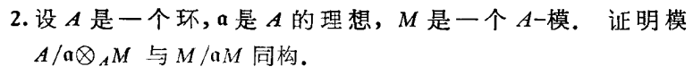

**<u>Proof</u>.** 考虑正合列 $0\to \mathfrak a\to A\to A/\mathfrak a\to 0$，tensor $M$，得到右正合列 
$$
\mathfrak a\otimes_AM\to M\to M\otimes_AA/\mathfrak a\to 0.
$$
左侧 $\mathfrak a\otimes_AM$ 在 $M$ 中的像为 $\mathfrak a\cdot M$，所以我们有 $M/\!_{\mathfrak a\cdot M}\cong M\otimes_AA/\!_{\mathfrak a}$。■

**<u>Remark</u>.** 一般来讲 tensor $M$ 以后的左侧的映射不一定是单射，比如说 $A=\C[X,Y],\mathfrak a=(X,Y), M=A/\mathfrak a$ 这种情况。在 $A/\mathfrak a$ 中，$X,Y$ 都等于零，所以张量完了实际上是
$$
(X,Y)\otimes_A A/\mathfrak a(\cong (X,Y)/\mathfrak a(X,Y)\cong\C X\oplus\C Y)\xrightarrow{0} \C \xrightarrow{\cong}\C\to0  
$$
 所以并不正合。

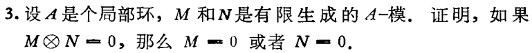

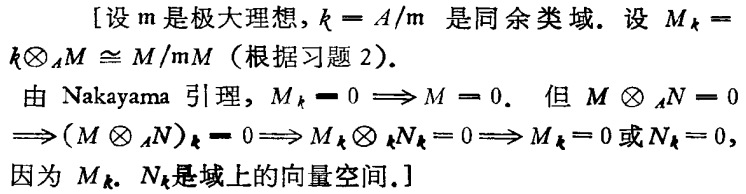

**<u>Remark</u>.** 这里注意 $k$ 是 $A$-模，并不只是个域。

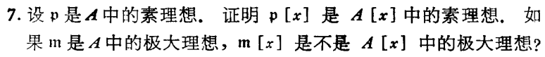

**<u>Proof</u>.** $\mathfrak p[x]=\text{Ker}(A[x]\to A/\mathfrak p[x])$，后者是整环，所以是素理想。当 $\mathfrak p$ 取成极大理想 $\mathfrak m$ 的时候，商环 $A/\mathfrak m[x]$ 不是域，所以 $\mathfrak m[x]$ 不是极大理想。■

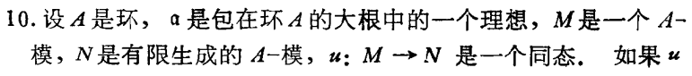

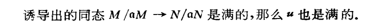

**<u>Proof</u>.** 利用 Nakayama 引理的推论，$\text{Coker}(u\otimes A/\mathfrak a)\cong \text{Coker}(u)\otimes A/\mathfrak a=0$，从而 $\text{Coker}(u)=\mathfrak a\text{Coker}(u)$ 所以等于零。■

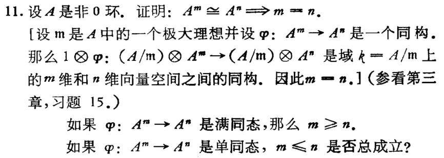

**<u>Proof</u>.** 满同态可以类似提示数维数，单同态的话考虑可数个 $k$ 的乘积，则 $A\oplus A$ 到 $A$ 有单射。但是如果我们假设 $A$ 是整环或者 $A$ 诺特的话，都仍然有 $m\leq n$。因为整环可以取分式域然后数维数，诺特环可以在 generic 点局部化成 Artin 环然后数长度。■

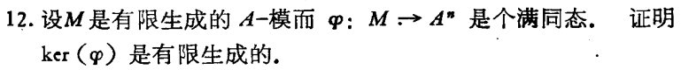

**<u>Proof</u>.** 由于 $A^n$ 是投射模，所以 $\varphi$ split，也就是说，$M\cong\text{Ker}\varphi\oplus A^n$。从而 $\text{Ker}\varphi$ 是 $M$ 的商模，从而有限生成。■

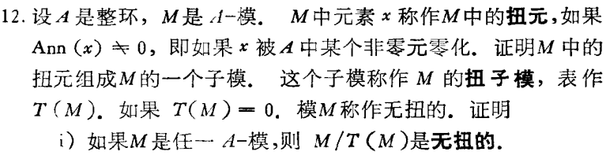

**<u>Remark</u>.** $Am$ 和 $T(M)$ 有交集，说明 $m$ 是 torsion 元，否则 $Am\cong A$，因为 $A$ 为整环所以没有 torsion。这说明任取 $[m]\in M/T(M)$，如果 $m$ torsion，则 $[m]=0$，否则 $Am\cap T(M)=0$ 则 $A[m]\cong Am$ 即 $[m]$ torsion free。

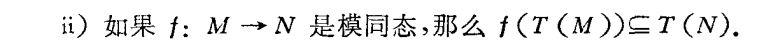

因为 $A/I$ 的商为 $A/J$，其中 $J$ 为包含 $I$ 的理想。所以如果 $I$ 为真理想，这是 $Am\cong A/I$ torsion，推出 $A[m]=\frac{Am}{Am\cap\text{Ker}(f)}\cong A/J$ 也 torsion。

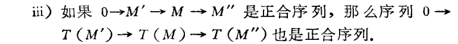

直接验证即可。

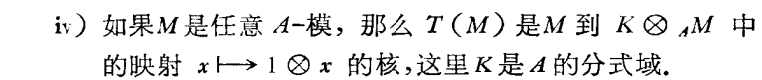

$K=(A-0)^{-1}A$ 所以根据局部化的定义直接得到。

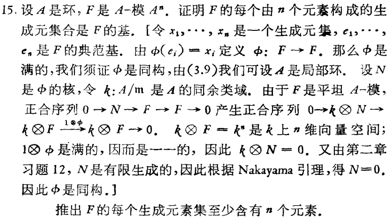

#### Zariski topology 与仿射概形

在本小节中，我们继续我们在饼中说的，要将一个环 $A$ 实现成一个环化空间 $(\text{Spec}(A),\mathcal{O}_{\text{Spec}(A)})$。这个环化空间就是我们的局部的几何对象，我们将要称之为仿射概形。 

与 Atiyah 的第一章的第 26 题类似，但我们先来考虑 $\C^2$。首先 $\C^2$ 上有很多函数，比如解析函数或者多项式函数。很多操作实际上对解析函数也可以进行，但是我们考虑的是代数几何，所以就直接考虑多项式函数。那么自然的，多项式函数函数构成一个环 $\C[X,Y]$。这里，我们注意实际上 $X:\C^2\to \C$ 和 $Y:\C^2\to \C$ 都是线性函数，也就是 $(\C^2)^\vee$ 中的一组基。而 $\C[X,Y]$ 可以看成 $(\C^2)^\vee$ 的 symmetric algebra。

> **<u>Remark</u>.** 这里有一些比较微妙的小地方，对于一般的域，尤其是有限域，$n$ 元多项式和多项式在 $k^n$ 上的函数并不相同。当 $k$ 是有限域时，$k^n$ 只有有限个点，但是有无限个多项式，所以肯定有两个不一样的多项式给出 $k^n$ 到 $k$ 完全相同的函数。实际上，当 $k$ 是无限域时，$k[x_1,...,x_n]$ 到 $\text{Hom}_{\mathbf {Sets}}(k^n,k)$ 是个单射。

对于 $\C^2$，取定 $\C^2$ 中的一点 $x=(\lambda,\mu)$，我们有赋值映射 
$$
ev_x:\C[X,Y]\to\C,\ f(X,Y)\mapsto f(\lambda,\mu)
$$
注意到赋值映射是满射，而且赋值映射的 kernel 刚好是极大理想 $(X-\lambda,Y-\mu)$。所以，从另一个角度看，赋值映射实际上也可以看成关于极大理想 $(X-\lambda,Y-\mu)$ 的商映射。换言之，赋值映射可以视为 
$$
ev_\mathfrak m:\C[X,Y]\to\C[X,Y]/\!_{(X-\lambda,Y-\mu)}\cong\C,\ f(X,Y)\mapsto [f]=f(\lambda,\mu).
$$
 将这一观点推而广之，对一般的环 $A$，设 $\mathfrak p$ 为 $A$ 的素理想，则我们有广义的赋值映射
$$
ev_\mathfrak p:A\to A/{\mathfrak p},\ f\mapsto [f]_{A/\mathfrak p}\in A/\mathfrak p.
$$
当然我们有一个问题，就是不同点(素理想，或者更确切的说，素谱上的不同的点)的取值的值域是互不相同的，所以赋值实际上不能直接的视为素谱上定义的，到同一个整环或者域的函数。但是，我们仍然可以考虑某个 $A$ 中元素的零点集和非零点集，并且把 $A$ 中的元素看成素谱 $\text{Spec}(A)$ 上的"函数"。

接下来我们利用这种观点来给出 $\text{Spec}(A)$ 上的 Zariski 拓扑。首先我们引入如下定义

**<u>Definition</u>.** (拓扑基) 设 $X$ 为一个集合，$\mathcal B$ 称为 $X$ 的一个**拓扑基**如果它是满足如下条件的子集族:

1. $\bigcup_{b\in \mathcal B}b=X$。
2. 任取 $b_1,b_2\in \mathcal B$，(虽然交集不一定在 $\mathcal B$ 里) 但是 $b_1\cap b_2$ 一定是 $\mathcal B$ 中若干元素的并。

若 $\mathcal B$ 是个拓扑基，则可以用 $\mathcal {B}$ 生成一个拓扑 $\mathcal T_\mathcal B$，其中开集为若干个基中元素的并。

> **<u>Example</u>.** 一个度量空间里面的开球就构成度量拓扑的拓扑基。

> 当然，一个拓扑基的一个 naive 的好处是可以减轻层公理验证的负担。回顾，拓扑空间 $X$ 上的一个阿贝尔群预层 $\mathcal F$ 是 $X$ 上的开集范畴 $\text{Op}_X$ 到阿贝尔群范畴的反变函子。而它是层当且仅当满足限制和粘合层公理。换言之也就是，对任意 $U$，开覆盖 $U=\cup_iU_i$，有 Abel 群正合列
> $$
> 0\to \mathcal F(U)\xrightarrow{\prod r^U_{U_i}}\prod_{i} \mathcal F(U_i)\xrightarrow{(f_i)\mapsto (f_i|_{U_{ij}}-f_j|_{U_{ij}}) } \prod_{ij} \mathcal F(U_i\cap U_j).
> $$
>
> 如果此时，$X$ 上的拓扑由基 $\mathcal B$ 给出，即 $\mathcal T=\mathcal T_\mathcal B$，则 $\mathcal B$ 到阿贝尔群范畴的反变函子 $\mathcal F$ 是 $X$ 上的层只需要满足基的层公理。具体的说，也就是，对任意 $b\in \mathcal B$，基的开覆盖 $b=\cup_ib_i$，以及 $b_i\cap b_j$ 的基覆盖 $b_i\cap b_j=\cup_{k}\ b_{ijk}$，有 Abel 群正合列
> $$
> 0\to \mathcal F(b)\xrightarrow{\prod r^b_{b_i}}\prod_{i} \mathcal F(b_i)\xrightarrow{(f_i)\mapsto (f_i|_{b_{ijk}}-f_j|_{b_{ijk}}) } \prod_{ij,k} \mathcal F(b_{ijk}).
> $$
>
> 此时，如果我们对任意 $U\in \mathcal T_\mathcal{B}$，我们可以定义 
> $$
> \mathcal F(U):=\text{Ker}(\prod_{b\in \mathcal B,b\subset U}\mathcal F(b)\to \prod_{b_{ijk}}\mathcal F(b_{ijk}))
> $$
> 此时，$\mathcal F$ 构成拓扑空间 $(X,\mathcal T_\mathcal B)$ 上的层 (参考 [Gortz and Wedhorne, Algebraic Geometry I] 的 page 49-50)。

**<u>Definition</u>.** (Zariski 拓扑) 设 $A$ 为环，$\text{Spec}(A)$ 为 $A$ 的素谱，$f,f_i\in A,i\in I$ 为一些环中的元素。那么我们定义如下的集合: 
$$
V(f):=\{\mathfrak p\in \text{Spec}(A) \ |\ [f]_{A/\mathfrak p}=0\},\\ 
D_f=\text{Spec}(A)-V(f)=\{\mathfrak p\in \text{Spec}(A) \ |\ [f]_{A/\mathfrak p}\neq 0\}\\
V(\{f_i|i\in I\})=\bigcap_{i\in I}V(f_i)
$$
其中，$V(f)$ 为 $f$ 的零点集，$V(\{f_i|i\in I\})$ 为集合 $\{f_i|i\in I\}$ 的公共零点集，而 $D_f$ 被称为 $f$ 确定的**主开集**。注意到 $D_1=\text{Spec}(A),D_{f_1}\cap D_{f_2}=D_{f_1f_2}$，所以主开集构成 $\text{Spec}(A)$ 上的一个开集基，利用主开集基生成一个拓扑，我们称作 **Zariski 拓扑**。Zariski 拓扑的开集为若干主开集的并，闭集为若干 $A$ 中元素的公共零点集。

> **<u>Remark</u>.** 
>
> 1. 直接利用定义可以看出，$\{f_\alpha\}_{\alpha\in S}$ 的公共零点集等于这个集合生成的理想的公共零点集。
>
> 2. 设 $I,J$ 为 $A$ 的理想，则
>
>    - ① $V(I+J)=V(I\cup J)=V(I)\cap V(J)$，
>    - ② $V(IJ)=V(I\cap J)=V(I)\cup V(J)$。
>
> 3. 给定 $\text{Spec}(A)$ 的子集 $E$，我们可以定义"在 $E$ 上消失的函数集" 
>    $$
>    \mathcal I(E):=\{\ f\in A\ |\ \forall\ \mathfrak p\in E, [f]_\mathfrak p=0\}=\bigcap_{\mathfrak p\in E}\mathfrak p.
>    $$
>    可以验证这个消失函数集构成一个理想。
>
> 4. 设 $I$ 为 $A$ 的理想，则 $\mathcal IV(I)=\bigcap_{\mathfrak p\supset I}\mathfrak p$，根据根理想的性质，有 $\mathcal IV(I)=\sqrt{I}$。(这一性质被称作 naive 版本的 Hilbert 零点定理。)
>
> 5. 可以直接用定义验证 $V\mathcal I(E)=\bar E$。
>
> 6. Zariski 拓扑进一步的性质我们会在第 7 次 talk 中详细介绍。

有了 Zariski 拓扑，我们离我们的几何体更近了一步。最后我们只需要构造它上面的环层。

**<u>Definition</u>.** 设 $A$ 为环，$\text{Spec}(A)$ 上的 Zariski 拓扑由主开集 $\{D_f|f\in A\}$ 构成的拓扑基生成。那么我们可以如下定义 $\text{Spec}(A)$ 上的**正则函数环层**(sheaf of regular functions) $\mathcal{O}_{\text{Spec}(A)}$ 为
$$
\mathcal{O}_{\text{Spec}(A)}:\ D_f\mapsto A[\frac{1}{f}],\ D_f\supset D_g,\ r^{D_f}_{D_g}: A[\frac{1}{f}]\xrightarrow{\text{localization}} A[\frac{1}{g}]
$$
限制公理和粘合公理可以在每个素理想的局部验证，从而 $\mathcal{O}_{\text{Spec}(A)}$ 是 $\text{Spec}(A)$ 上的环层。

**<u>Definition</u>.** 我们称同构于 $(\text{Spec}(A),\mathcal O_{\text{Spec}(A)})$ 的环化空间为**仿射概形**(affine scheme)。

**<u>Definition</u>.** (预层的茎、芽) 设 $X$ 为拓扑空间，$\mathcal F$ 为 $X$ 上的预层，$x\in X$。那么我们定义 $\mathcal F$ 在 $x$ 点处的**茎**(stalk) $\mathcal F_x$ 为如下的阿贝尔群:
$$
\mathcal F_x:\ \bigsqcup_{x\in U}\mathcal F(U)/\!_{\{\ (s_1,U_1)\sim (s_2,U_2)\textbf{ iff }\exists\ U_3,\ s.t.\ x\in U_3\subset U_1\cap U_2 ,\ s_1|_{U_3}=s_2|_{U_3}\}}
$$
即 $\mathcal F$ 在点 $x$ 的茎是指 $x$ 的邻域的截面的等价类，满足两个截面等价当且仅当限制在更小的 $x$ 的邻域上二者相等。茎里的元素称作**截面芽**(germ)，截面芽可以长出一个截面。

**<u>Proposition</u>.** 设 $X$ 为拓扑空间，$\mathcal F,\mathcal G$ 为 $X$ 上的预层，$\phi:\mathcal F\to \mathcal G$ 为预层同态。任取 $x\in X$，我们有对应的茎的同态 $\phi_x:\mathcal F_x\to \mathcal G_x,\ [(s,U)]\mapsto [\phi_U(s),U]$。所以取茎是一个函子。 

**<u>Example</u>.** 

1. 考虑 $\R^n$ 上的光滑函数层 $C^\infty_{\R^n}$，那么一个点附近的光滑函数茎为光滑函数的等价类。当 $n=1$ 时，在 $0$ 点附近，我们有光滑函数
   $$
   f:\ f(x)=\begin{cases}e^{-\frac{1}{x^2}},&\ \text{if } x\neq0  \\0 ,&\ \text{if } x=0  \end{cases}
   $$
   则 $f$ 在茎 $C^\infty_{\R,0}$ 中不等于零 (等于零要求在一个邻域内恒等于零)。所以 $C^\infty_{\R,0}$ 是一个挺大的环。另外，这一现象也说明求点 $x$ 处的芽和求点 $x$ 处的赋值往往并不相同，所以需要小心。

2. $C^\infty_{\R,0}$ 是个局部环，因为函数的赋值映射良定义在函数芽上，即 
   $$
   ev_0:\  C^\infty_{\R,0}\to \R,\ [f]\mapsto f(0)\in\R
   $$
   与代表元选取无关，并且是满射。另一方面如果赋值映射不等于零，则 $f$ 在零点附近可逆，所以也在函数茎中可逆。也就是说，赋值映射的 kernel 是极大理想 (因为商是$\R$) 并且极大理想以外的元素都可逆，那么说明 $C^\infty_{\R,0}$ 有唯一的极大理想，那么它是个局部环。

**<u>Definition</u>.** 一个环化空间 $(X,\mathcal O_X)$ 被称作**局部环化空间**(locally ringed space)若任取 $x\in X$，茎 $\mathcal O_{X,x}$ 为局部环。

**<u>Example</u>.** 光滑流形 $(\R^n, C^\infty_{\R^n})$ 和复流形 $(D^n, \mathscr O_{D^n})$ 都是局部环化空间。$\R^n$ 配以局部常值层 $\Z$，构成环化空间，但不构成局部环化空间。

**<u>Example</u>.** 设 $A$ 为环，$(\text{Spec}(A),\mathcal O_{\text{Spec}(A)})$ 为对应的仿射概形，则任取 $\mathfrak p\in \text{Spec}(A)$，我们有
$$
\mathcal O_{\text{Spec}(A),\mathfrak p}=A_\mathfrak p
$$
即仿射概形为局部环化空间。

**<u>Definition</u>.** 设 $(X,\mathcal O_X)$，$(Y,\mathcal O_Y)$ 为两个局部环化空间，$(f,f^\sharp)$ 为 $(X,\mathcal O_X)$ 到 $(Y,\mathcal O_Y)$ 的环化空间态射。我们称 $(f,f^\sharp)$ 为**局部环化空间态射**，若 $f^\sharp:f^{-1}\mathcal{O}_Y\to \mathcal{O}_X$ 在 $X$ 每个点 $x$ 的 stalk 上的环同态 $f^\sharp_x:\mathcal O_{Y,f(x)}\to \mathcal O_{X,x}$ 满足极大理想的原象是极大理想(这种同态被称为局部同态)。于是我们可以定义局部环化空间范畴。而仿射概形在局部环化空间范畴粘合得到的局部环化空间，我们称为**概形**(Scheme)。

> **<u>Remark</u>.** 对于环化空间或局部环化空间，这个两个范畴的始对象都是零环的谱，对应的是空集为底空间的局部环化空间。

**<u>Proposition</u>.** 设 $A,B$ 为环 $\phi:A\to B$ 为环同态，则我们有由 $\phi$ 诱导的局部环化空间的态射 $\phi^{op}=(\phi^{op}_0,\phi^{op,\flat})$，其中

1. $\phi^{op}_0:\text{Spec}(B)\to\text{Spec}(A),\mathfrak p_B\mapsto \phi^{-1}\mathfrak p_B$ 为连续映射， 
2. $\phi^{op,\flat}:\ \ \phi^{op,\flat}_{D_f}:A[\frac{1}{f}]\to B[\frac{1}{\phi(f)}],\frac{a}{f^n}\mapsto \frac{\phi(a)}{\phi(f^n)}$ 为环层同态，并且对应的 $\phi^{op,\sharp}_{\mathfrak p_B}$，由局部环的**局部同态** $A_{\phi^{-1}\mathfrak p_B}\xrightarrow{\phi_{\mathfrak p_B}}  B_{\mathfrak p_B}$ 给出。

**<u>Corollary</u>.** 设 $\textbf{Rings}$ 为有单位元的交换环范畴，$\textbf{Aff}$ 为仿射概形范畴，则我们有反变函子
$$
\text{Spec}:\ \textbf{Rings}^{op}\to\textbf{Aff},\ \ \begin{array}[c] { }A \mapsto (\text{Spec}(A),\mathcal O_{\text{Spec}(A)}),\\ A \xrightarrow{\phi} B\ \ \mapsto\ \  
\phi^{op}:\ (\text{Spec}(B),\mathcal O_{\text{Spec}(B)})\to (\text{Spec}(A),\mathcal O_{\text{Spec}(A)})\end{array}
$$
而取整体截面给出了逆函子 $\Gamma:(\text{Spec}(A),\mathcal O_{\text{Spec}(A)})\mapsto A$。换言之，仿射概形范畴等价于环范畴的反范畴。

> **<u>Remark</u>.** 一般来讲一个范畴的反范畴是很难找到任何几何解释的，但是环范畴不是。它的反范畴确实有几何解释。

当然不仅环可以层化，环上的模也可以"层化"。(仅在此处为了描述层化以后的模) 我们引入环层的模层的概念。

**<u>Definition</u>.** 设 $(X,\mathcal{O}_X)$ 为环化空间，$\mathcal F$ 为 $X$ 上的阿贝尔群层，我们称 $\mathcal F$ 为 $X$ 上的 $\mathcal O_X$-模层，如果对于每个开集 $U$，$\mathcal F(U)$ 都是 $\mathcal O_X(U)$ 模，并且模结构与限制满足交换图:

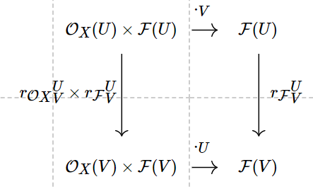

也就是限制与数乘适配，则我们称 $\mathcal F$ 为 **$\mathcal O_X$-模层**或者 **$\mathcal{O}_X$-模**。两个 $\mathcal O_X$ 模的同态被定义为阿贝尔群层同态并且每个 $U$ 上是 $\mathcal{O}_X(U)$-模同态。于是 $\mathcal O_X$-模构成一个范畴，我们记为 $\mathcal O_X\text{-mod}$。

> **<u>Remark</u>.** 两个 $\mathcal{O}_X$ 模 $\mathcal F,\mathcal G$ 可以有
>
> + - 同态群 $\text{Hom}_{\mathcal O_X}(\mathcal F,\mathcal G)$ 
>   - 局部同态层 $\mathcal H om_{\mathcal O_X}(\mathcal F,\mathcal G):\ U\mapsto \text{Hom}_{\mathcal O_U}(\mathcal F|_U,\mathcal G|_U)$
>   - 张量层 $\mathcal F\otimes_{\mathcal O_X}\mathcal G$，定义为预层 $U\mapsto \mathcal F(U)\otimes_{\mathcal O_X(U)}\mathcal G(U)$ 的层化。

**<u>Definition</u>.** 设 $A$ 为环，$(\text{Spec}(A),\mathcal O_{\text{Spec}(A)})$ 为对应的仿射概形，$M$ 为 $A$ 模。则我们可以在 $\text{Spec}(A)$ 上定义一个由 $M$ 诱导的 $\mathcal O_{\text{Spec}(A)}$-模
$$
\tilde{M}:\ \ D_f\mapsto M[\frac{1}{f}],\ D_f\supset D_g,\ r^{D_f}_{D_g}: M[\frac{1}{f}]\xrightarrow{\text{localization}} M[\frac{1}{g}].
$$
 并且 $M=\tilde M(\text{Spec}(A))$。我们称形如 $\tilde M$ 的 $\mathcal O_X$-模为**拟凝聚**(quasi-coherent) $\mathcal O_X$-模层。当 $A$ 为诺特环，$M$ 为有限生成模的时候，我们称形如 $\tilde M$ 的 $\mathcal O_X$-模为**凝聚**(coherent) $\mathcal O_X$-模层。

> **<u>Remark</u>.** 对于概形而言，凝聚或拟凝聚是指限制在每个仿射开集上都来源于模的 tilde 的 $\mathcal O_X$ 模层。
>
> **<u>Remark</u>.** 任取 $\mathfrak p\in \text{Spec}(A)$，我们有
> $$
> \tilde M_{\text{Spec}(A),\mathfrak p}=M_\mathfrak p
> $$
> 即仿射概形上 quasi-coherent sheaf 的茎是对应素理想的局部化。

**<u>Example</u>.** 并不是所有模都是 quasi-coherent 的。比如 $\text{Spec}(\Z)$ 上支集在 $(p)$ 的 $\Z_p$，即 $i_{(p)*}\Z_{(p)}$，它的整体截面在 $(q)$ 处的局部化是 $\Q$ 而它作为层在 $(q)$ 处的 stalk 是零。

**<u>Remark</u>.** 对于仿射概形和它上面的凝聚/拟凝聚层，我们在后面会进行更深入的研究。

 

